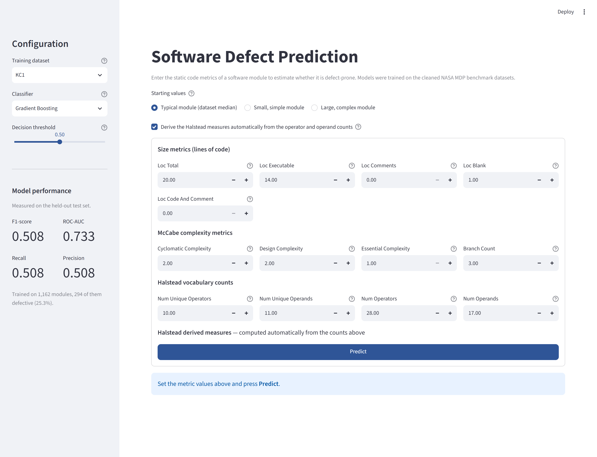
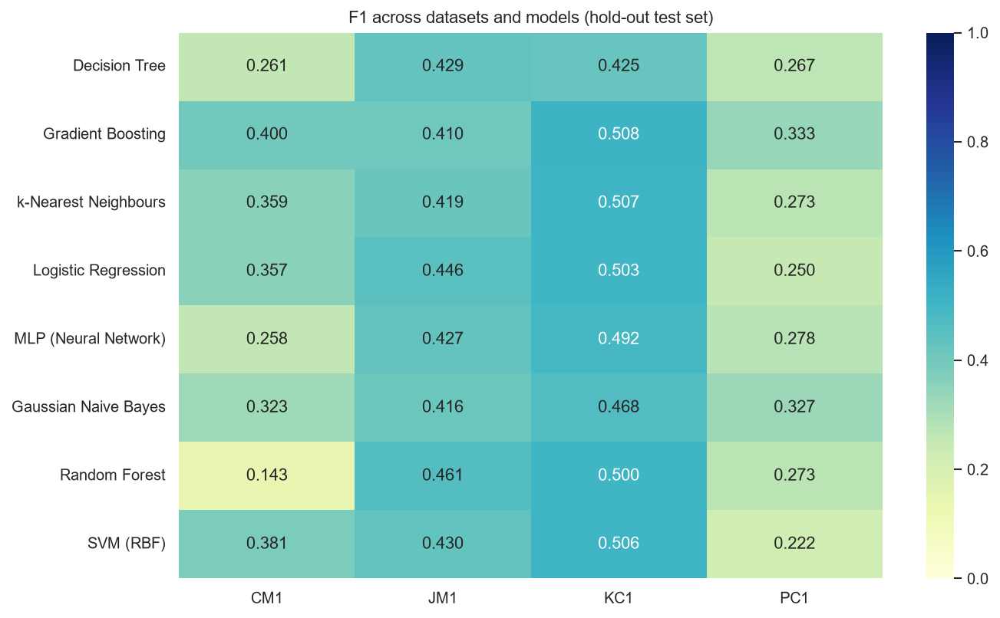
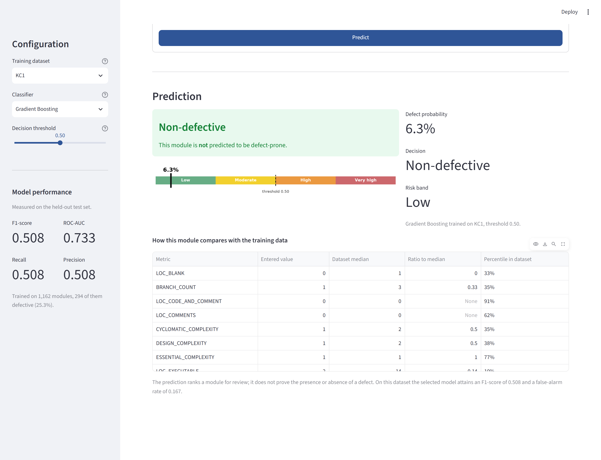
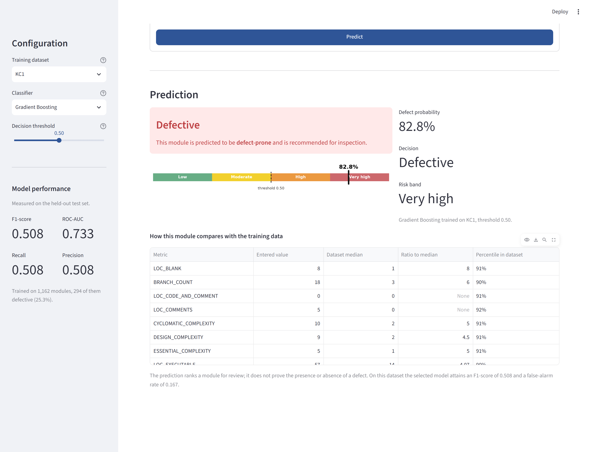
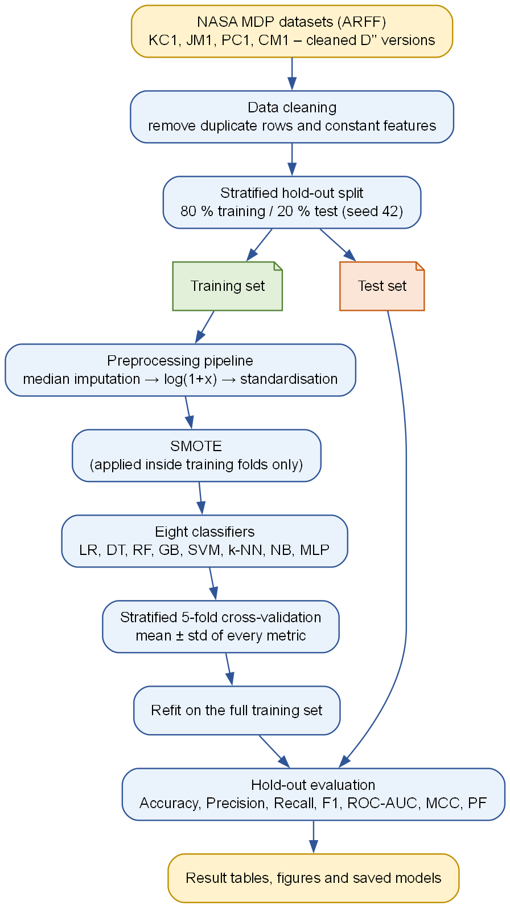
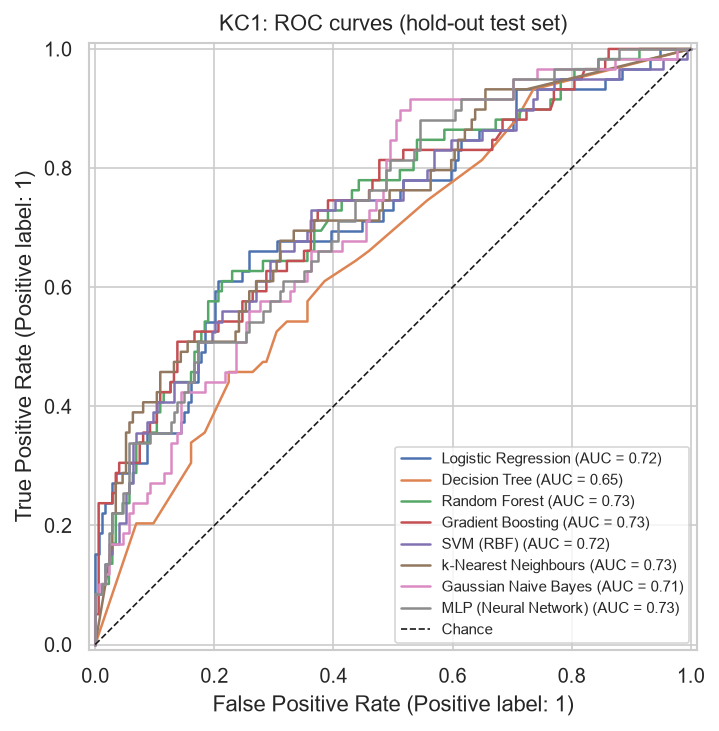
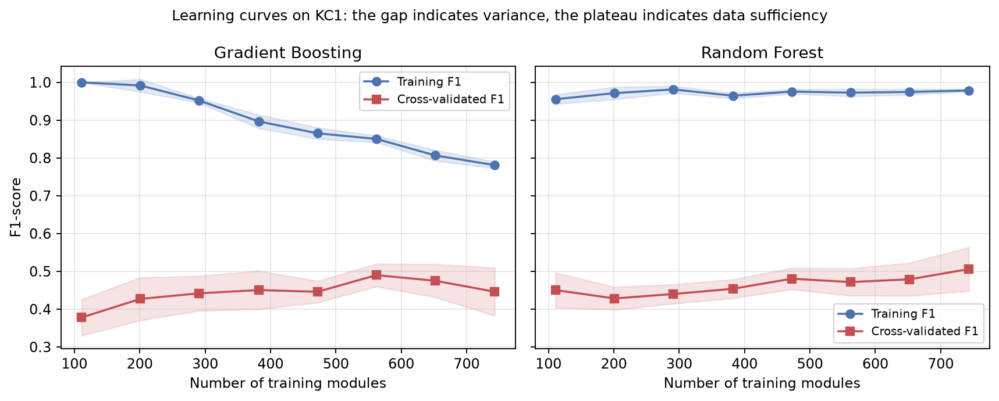

# Software Defect Prediction using Machine Learning

A reproducible, end-to-end machine-learning project that predicts **defect-prone
software modules** from static code metrics (McCabe, Halstead and lines-of-code
measures) using the NASA MDP / PROMISE benchmark datasets — with an interactive
web interface for scoring a module by hand.

Developed as the **Minor Project (CS16095)** for the M.Tech. in Computer Science
& Engineering programme.



---

## 1. Project overview

| Item | Description |
|---|---|
| **Task** | Binary classification – is a module *defective* (1) or *non-defective* (0)? |
| **Datasets** | NASA MDP: **KC1, JM1, PC1, CM1** (cleaned "D''" versions, Shepperd et al. 2013) |
| **Features** | 21–37 static code metrics per module (LOC, cyclomatic complexity, Halstead volume/effort, …) |
| **Models** | Logistic Regression, Decision Tree, Random Forest, Gradient Boosting, SVM (RBF), k-NN, Gaussian Naive Bayes, MLP |
| **Imbalance handling** | SMOTE (default), class weighting, or none – selectable in `config.yaml` |
| **Validation** | Stratified 80/20 hold-out split **plus** stratified k-fold cross-validation on the training portion |
| **Metrics** | Accuracy, Precision, Recall, F1-score, ROC-AUC, MCC, Balanced Accuracy, Probability of False Alarm (PF) |
| **Interface** | Streamlit web app for manual metric entry, plus four command-line tools |
| **Tests** | 16 automated tests (`pytest`), including a determinism check |

### Headline results

Hold-out test performance, seed 42, SMOTE balancing. Best F1 per dataset in bold.

| Model | KC1 | JM1 | PC1 | CM1 |
|---|---|---|---|---|
| Gradient Boosting | **0.509** | 0.410 | **0.333** | **0.400** |
| k-Nearest Neighbours | 0.507 | 0.419 | 0.273 | 0.359 |
| SVM (RBF) | 0.506 | 0.430 | 0.222 | 0.381 |
| Logistic Regression | 0.503 | 0.446 | 0.250 | 0.357 |
| Random Forest | 0.500 | **0.461** | 0.273 | 0.143 |
| MLP | 0.492 | 0.427 | 0.278 | 0.258 |
| Gaussian Naive Bayes | 0.468 | 0.416 | 0.327 | 0.323 |
| Decision Tree | 0.425 | 0.429 | 0.267 | 0.261 |

Gradient Boosting has the best mean rank (2.75). Seven of the eight models sit
within cross-validation noise of each other; only the single Decision Tree is
reliably weakest.



---

## 2. The web interface

```bash
streamlit run app/streamlit_app.py      # http://localhost:8501
```

Loads the pipelines already trained by `run_pipeline.py` — nothing is retrained.
Enter the metrics of a single module and press **Predict**.

**What it does**

* **Grouped entry form** — size, McCabe and Halstead metrics, each field bounded
  by the range seen in the training data and annotated with what it measures.
* **Halstead auto-derivation** — the eight dependent measures (volume, difficulty,
  effort, level, programming time, estimated bugs …) are computed from `n1`, `n2`,
  `N1`, `N2`, so the submitted values stay mutually consistent. A user entering
  them by hand could otherwise supply a combination no real program can exhibit.
* **Presets** — fill the form with the 10th, 50th or 90th percentile of the
  training data as a realistic starting point, then edit.
* **Configurable** — any of the four datasets, any of the eight classifiers, and
  a decision-threshold slider that moves between a conservative (high precision)
  and a sensitive (high recall) operating point without retraining.
* **Context, not just a verdict** — every entered metric is tabulated against the
  dataset median and its percentile, so you can see how unusual the module is.

### A module predicted **non-defective**

A small, simple module — 20 lines, cyclomatic complexity 1 — scores **6.3 %**:



### A module predicted **defective**

A large, complex module — 73 lines, cyclomatic complexity 10, 18 branches —
scores **82.8 %**:



> The output ranks a module for review; it does not prove a defect is present.
> At this operating point precision is 0.509, so roughly one flagged module in
> two is a false alarm. That is still far better than reviewing uniformly.

---

## 3. Folder structure

```
software-defect-prediction/
├── config.yaml                 # single source of truth for all experiment settings
├── requirements.txt            # pip dependencies
├── pyproject.toml              # optional: pip install -e .
├── README.md
├── .gitignore
│
├── sdp/                        # importable Python package
│   ├── __init__.py
│   ├── config.py               # load + validate config.yaml
│   ├── utils.py                # logging, seeding, paths, JSON helpers
│   ├── data_loader.py          # download + ARFF parsing + target encoding
│   ├── preprocessing.py        # cleaning, split, imputation/log/scaling pipeline, SMOTE
│   ├── models.py               # model registry + hyper-parameter search spaces
│   ├── evaluate.py             # metrics, cross-validation, hold-out evaluation
│   ├── visualization.py        # every figure used in the report
│   └── eda.py                  # exploratory data analysis driver
│
├── app/
│   └── streamlit_app.py        # interactive web interface (manual metric entry)
│
├── scripts/                    # command-line entry points
│   ├── download_data.py        # fetch datasets into data/raw/
│   ├── run_eda.py              # summary statistics + EDA figures
│   ├── run_pipeline.py         # train, cross-validate, evaluate, plot, save models
│   ├── predict.py              # score a CSV of modules with a saved model
│   ├── make_report_figures.py  # design diagrams + collect result figures
│   ├── make_extra_figures.py   # console captures, ER model, learning curves
│   ├── capture_app_screenshots.py  # drive the running app and capture its figures
│   └── build_report_docx.py    # assemble the Word report
│
├── tests/
│   ├── test_pipeline.py        # unit + smoke tests for the pipeline
│   └── test_app.py             # tests for the web interface logic
│
├── data/
│   ├── raw/                    # downloaded .arff files (git-ignored)
│   ├── processed/              # reserved for cached/processed data
│   └── sample_modules.csv      # two example modules for predict.py
│
├── results/                    # generated by the scripts (git-ignored)
│   ├── <DATASET>/
│   │   ├── eda/                # summary_statistics.csv, dataset_overview.json, EDA figures
│   │   ├── figures/            # roc_curves.png, pr_curves.png, confusion_matrices.png, ...
│   │   ├── models/             # <model>.joblib
│   │   ├── test_metrics.csv    # one row per model (hold-out + CV metrics)
│   │   ├── test_metrics.json
│   │   └── run_summary.json
│   ├── summary_all_datasets.csv
│   ├── cross_dataset_f1.png
│   └── cross_dataset_roc_auc.png
│
└── report/
    ├── Minor_Project_Report_Revised.docx  # ← the submission document
    ├── Minor_Project_Report.docx          # earlier layout, superseded
    ├── Minor_Project_Report.md            # earlier Markdown draft, superseded
    ├── figures/                # all 40 report figures (diagrams, results, screenshots)
    ├── captures/               # raw console output used for the terminal figures
    ├── viva_questions.md       # likely viva questions with answers
    ├── figures_and_tables_guide.md
    └── references.bib          # BibTeX for all cited works
```

---

## 4. Setup

### 4.1 Prerequisites
* Python **3.9 or newer** (tested on 3.13)
* `pip`
* Internet connection for the first run (datasets are ~1 MB in total)

### 4.2 Installation

```bash
# 1. (recommended) create and activate a virtual environment
python -m venv .venv
.venv\Scripts\activate          # Windows
# source .venv/bin/activate     # Linux / macOS

# 2. install dependencies
pip install -r requirements.txt
```

---

## 5. Running the project

All commands are run from the project root.

```bash
# Step 1 - download the datasets (KC1, JM1, PC1, CM1)
python scripts/download_data.py

# Step 2 - exploratory data analysis (figures + statistics)
python scripts/run_eda.py --all            # or: --dataset KC1

# Step 3 - train, cross-validate and evaluate every model
python scripts/run_pipeline.py --all       # or: --dataset KC1

# Step 4 - launch the interactive web interface
streamlit run app/streamlit_app.py         # http://localhost:8501

# Step 5 (optional) - run the tests
python -m pytest -q                        # 16 passed
```

Typical run-time on a laptop: EDA < 1 min; full pipeline on all four datasets
≈ 5–10 min (JM1 with SVM is the slowest part). Steps 1–3 must be run before
step 4, because the app loads the models they produce.

### 5.1 Useful options

| Command | Effect |
|---|---|
| `python scripts/run_pipeline.py --dataset PC1` | single dataset |
| `python scripts/run_pipeline.py --balance none` | disable SMOTE (the ablation study) |
| `python scripts/run_pipeline.py --balance class_weight` | cost-sensitive learning instead of SMOTE |
| `python scripts/run_pipeline.py --tune` | enable `RandomizedSearchCV` hyper-parameter search |
| `python scripts/predict.py --dataset KC1 --model gradient_boosting --input data/sample_modules.csv` | score a CSV of modules (sample file included) |

### 5.2 Changing the experiment

Edit `config.yaml` – no code changes required:

* `datasets.variant` – `cleaned` (default) or `original`
* `preprocessing.balance` – `smote` / `class_weight` / `none`
* `preprocessing.log_transform`, `preprocessing.scaler`
* `cross_validation.n_splits`, `n_repeats`, `n_jobs`
* `models` – add/remove models (names from `sdp/models.py::MODEL_REGISTRY`)
* `random_seed` – change to check robustness of conclusions

---

## 6. Dataset

**Source:** NASA Metrics Data Program (MDP), redistributed through the PROMISE
Software Engineering Repository. The project downloads the files automatically
from a public GitHub mirror:

* Cleaned (default): `https://github.com/klainfo/NASADefectDataset/tree/master/CleanedData/MDP/D''`
* Original: `https://github.com/klainfo/NASADefectDataset/tree/master/OriginalData/MDP`

Fallback: OpenML (`kc1`, `jm1`, `pc1`, `cm1`) via `sklearn.datasets.fetch_openml`.

**Manual download (if the script cannot reach the internet):** open the GitHub
link above, download `KC1.arff`, `JM1.arff`, `PC1.arff`, `CM1.arff`, and place
them in `data/raw/cleaned/`.

| Dataset | Language | Domain | Modules (cleaned) | Features | Defective % |
|---|---|---|---|---|---|
| KC1 | C++ | Storage management for ground data | 1,162 | 21 | 25.3 % |
| JM1 | C | Real-time predictive ground system | 7,720 | 21 | 20.9 % |
| PC1 | C | Flight software for an earth-orbiting satellite | 679 | 37 | 8.1 % |
| CM1 | C | Spacecraft instrument | 327 | 37 | 12.8 % |

Each row is one software module; the columns are static code metrics
(McCabe cyclomatic/design/essential complexity, Halstead length/volume/
difficulty/effort, operator/operand counts, LOC variants) and a binary
`defective` label.

The **cleaned** versions are used by default because the original files contain
extensive duplication — KC1 drops from 2,109 to 1,162 rows. Duplicates spanning
the train/test boundary inflate every measure.

---

## 7. Methodology



1. **Cleaning** – drop duplicate rows and zero-variance columns.
2. **Stratified split** – 80 % train / 20 % test, defect ratio preserved.
3. **Preprocessing pipeline** (fitted on training folds only, no leakage):
   median imputation → `log1p` transform (metrics are heavily right-skewed) → standardisation.
4. **Class-imbalance handling** – SMOTE applied *inside* the pipeline so synthetic
   samples are generated only from training folds.
5. **Cross-validation** – stratified k-fold on the training set for every model.
6. **Hold-out evaluation** – final fit on the full training set; metrics on the
   untouched test set.
7. **Comparison** – tables and figures for every model and every dataset.

Every learned step lives inside a scikit-learn / imbalanced-learn `Pipeline`, so
it is refitted within each CV fold. This is what structurally prevents the
information leakage that affects much of the published literature.

---

## 8. Results

After running `python scripts/run_pipeline.py --all`, see:

* `results/<DATASET>/test_metrics.csv` – per-model metrics
* `results/summary_all_datasets.csv` – all datasets in one table
* `results/cross_dataset_f1.png`, `results/cross_dataset_roc_auc.png` – heatmaps
* `results/<DATASET>/figures/*.png` – ROC, PR, confusion matrices, feature importance

### ROC curves (KC1)

The near-coincidence of seven curves is the central finding: on these data most
reasonable classifiers are hard to separate.



### Effect of class balancing

Without SMOTE, Logistic Regression and SVM reach precision 1.000 but recall
**0.153** — they detect 9 of 59 defective modules while reporting a deceptively
high 78.5 % accuracy. With SMOTE, recall rises to **0.678** and F1 nearly
doubles. Accuracy is a misleading headline metric for this problem.

### Why performance plateaus

Learning curves show a persistent gap between training and validation scores,
and a validation curve that flattens after ~300 modules. The ceiling is set by
the information content of static metrics, not the amount of data.



---

## 9. Building the report

`report/Minor_Project_Report_Revised.docx` is generated in the departmental
format. It uses `../A PROJECT REPORT.docx` as the base file, so the university
header banner, the page-number footer, the page size and the margins are
inherited from the official template; only the body is replaced.

```bash
# 1. regenerate every figure (40 in total)
python scripts/make_report_figures.py     # methodology, architecture, DFD, use case, pipeline
python scripts/make_extra_figures.py      # console captures, ER model, learning curves

# 2. capture the web-interface figures (the app must be running)
streamlit run app/streamlit_app.py &
python scripts/capture_app_screenshots.py

# 3. build the Word document
python scripts/build_report_docx.py --lists abbreviations-only \
       --output report/Minor_Project_Report_Revised.docx
```

Useful options:

| Command | Effect |
|---|---|
| `--code-detail brief` | shorter Chapter 16 (≈ 3 pages less) |
| `--code-detail full` | every source listing (≈ 5 pages more) |
| `--front-matter full` | add Declaration, Acknowledgement and Abstract pages |
| `--lists all` | add List of Figures and List of Tables |
| `--template "path/to/other.docx"` | use a different departmental template |

Page numbers in the Contents are Word `PAGEREF` fields. Open the `.docx` and
press **Ctrl+A** then **F9** to refresh them after any change that alters
pagination.

The report content lives in `scripts/report_chapters_a.py` (Chapters 1–11) and
`scripts/report_chapters_b.py` (Chapters 12–21), with the formatting rules in
`scripts/docx_builder.py`. All result tables are read from
`results/*/test_metrics.csv` at build time, so the report cannot drift out of
step with the code.

---

## 10. Reproducibility

* A single `random_seed` (default 42) controls the split, CV folds, SMOTE and
  every stochastic model.
* All settings live in `config.yaml`; every run writes the effective settings
  to `results/<DATASET>/run_summary.json`.
* `tests/test_pipeline.py::test_pipeline_is_deterministic` asserts that two
  identical runs produce identical metrics.

**Platform note:** cross-validation runs sequentially by default
(`cross_validation.n_jobs: 1`). libsvm proved unstable inside `loky` worker
processes on Windows; raise `n_jobs` on Linux for a useful speed-up.

---

## 11. Licence and acknowledgements

Datasets © NASA MDP / PROMISE repository; cleaned versions courtesy of
Shepperd, Song, Sun and Mair (2013). Code released under the MIT licence.
