# SOFTWARE DEFECT PREDICTION USING MACHINE LEARNING

### A Minor Project Report (CS16095)

*Submitted in partial fulfilment of the requirements for the award of the degree of*

## MASTER OF TECHNOLOGY
### in
## COMPUTER SCIENCE AND ENGINEERING

**Submitted by**

**SONAM KUMARI**\
Registration No.: NSU253121001\
Roll No.: 253121001\
M.Tech. (CSE), 2nd Semester, Session 2025–2026

**Under the guidance of**

**Ritesh Kumar Jha**\
Assistant Professor (CS & IT), Department of Computer Science & Engineering

**DEPARTMENT OF COMPUTER SCIENCE & ENGINEERING**\
**NETAJI SUBHAS UNIVERSITY**\
**JAMSHEDPUR, JHARKHAND**

**SEPTEMBER 2026**

```{=openxml}
<w:p><w:r><w:br w:type="page"/></w:r></w:p>
```

## CERTIFICATE

This is to certify that the Minor Project report entitled **"Software Defect Prediction using Machine Learning"** submitted by **Sonam Kumari** (Registration No. NSU253121001, Roll No. 253121001) in partial fulfilment of the requirements for the award of the degree of *Master of Technology in Computer Science and Engineering* at **Netaji Subhas University, Jamshedpur**, is a bona fide record of the work carried out by the student under my supervision and guidance during the academic session 2025–2026.

The work embodied in this report has not been submitted to any other university or institution for the award of any degree or diploma.

| | |
|---|---|
| **Ritesh Kumar Jha** | **Lal Kishore Kumar** |
| Project Guide | Head of Department |
| Department of Computer Science & Engineering | Department of Computer Science & Engineering |
| Netaji Subhas University, Jamshedpur | Netaji Subhas University, Jamshedpur |
| Signature: ____________________ | Signature: ____________________ |

External Examiner: ____________________

Date: ____________\
Place: Jamshedpur

```{=openxml}
<w:p><w:r><w:br w:type="page"/></w:r></w:p>
```

## DECLARATION

I, **Sonam Kumari**, Registration No. NSU253121001, hereby declare that the Minor Project report entitled **"Software Defect Prediction using Machine Learning"** is an original work carried out by me under the guidance of **Ritesh Kumar Jha**, Department of Computer Science & Engineering, Netaji Subhas University, Jamshedpur.

I further declare that:

1. The work has not been submitted, in part or in full, for any other degree or diploma of this or any other university.
2. All sources of information, data and ideas have been duly acknowledged and cited in the References section.
3. The results reported have been obtained by executing the code described in this report, and the source code is submitted along with the report.
4. I have followed the academic integrity and plagiarism policy of the University.

**Sonam Kumari**\
Registration No.: NSU253121001\
Signature: ____________________\
Date: ____________\
Place: Jamshedpur

```{=openxml}
<w:p><w:r><w:br w:type="page"/></w:r></w:p>
```

## ACKNOWLEDGEMENT

I express my sincere gratitude to my project guide, **Ritesh Kumar Jha**, Assistant Professor (CS & IT), Department of Computer Science & Engineering, Netaji Subhas University, for continuous support, valuable suggestions and constructive criticism throughout this project. The regular discussions on experimental design and evaluation methodology were instrumental in shaping this work.

I am grateful to **Lal Kishore Kumar**, Head of the Department of Computer Science & Engineering, for providing the necessary facilities and an encouraging academic environment.

I also thank the faculty members of the department, particularly those teaching *Advanced Software Engineering* and *Soft Computing Techniques*, whose courses provided the conceptual foundation for this project.

I acknowledge the NASA Metrics Data Program and the maintainers of the PROMISE Software Engineering Repository for making the datasets publicly available, and the developers of the open-source Python ecosystem (scikit-learn, imbalanced-learn, pandas and matplotlib) on which this work is built.

Finally, I thank my family and friends for their patience and encouragement.

**Sonam Kumari**

```{=openxml}
<w:p><w:r><w:br w:type="page"/></w:r></w:p>
```

## ABSTRACT

Software defects discovered late in the development life cycle are expensive to fix and can compromise the reliability of the delivered system. Software Defect Prediction (SDP) aims to identify defect-prone modules *before* testing so that limited quality-assurance effort can be focused where it is most needed. This project reproduces and extends the standard machine-learning approach to SDP using static code metrics.

Four publicly available benchmark datasets from the NASA Metrics Data Program (KC1, JM1, PC1 and CM1), in the cleaned form proposed by Shepperd et al. [6], were used. Each dataset describes software modules by 21–37 McCabe, Halstead and size metrics together with a binary defect label. A leakage-free pipeline was implemented in Python comprising duplicate and constant-feature removal, median imputation, logarithmic transformation, standardisation and Synthetic Minority Over-sampling (SMOTE) applied strictly within training folds. Eight classifiers — Logistic Regression, Decision Tree, Random Forest, Gradient Boosting, Support Vector Machine, k-Nearest Neighbours, Gaussian Naive Bayes and a Multi-Layer Perceptron — were compared using stratified five-fold cross-validation and an independent stratified hold-out test set. Performance was measured with Accuracy, Precision, Recall, F1-score, ROC-AUC, Matthews Correlation Coefficient and Probability of False Alarm.

Gradient Boosting achieved the best F1-score on three of the four datasets (KC1: F1 = 0.509, ROC-AUC = 0.733; PC1: ROC-AUC = 0.858; CM1: ROC-AUC = 0.795) and the best mean rank overall, while Random Forest was best on the largest dataset, JM1 (F1 = 0.461, ROC-AUC = 0.717). An ablation study showed that class balancing is essential: without SMOTE, Logistic Regression and SVM attained a precision of 1.0 on KC1 but a recall of only 0.15, whereas with SMOTE recall rose to 0.68 at a modest cost in accuracy. Halstead difficulty, unique operator and operand counts and executable lines of code were the most informative metrics. The results are consistent with the published literature and confirm that ensemble methods combined with class-imbalance handling provide a practical, reproducible baseline for defect prediction.

**Keywords:** software defect prediction; static code metrics; machine learning; class imbalance; SMOTE; NASA MDP; ensemble learning; software quality.

```{=openxml}
<w:p><w:r><w:br w:type="page"/></w:r></w:p>
```

## TABLE OF CONTENTS

| Section | |
|---|---|
| Certificate | i |
| Declaration | ii |
| Acknowledgement | iii |
| Abstract | iv |
| Table of Contents | v |
| List of Figures | vii |
| List of Tables | viii |
| List of Abbreviations | ix |
| **Chapter 1: Introduction** | |
| 1.1 Background | |
| 1.2 Motivation | |
| 1.3 Scope of the Project | |
| 1.4 Organisation of the Report | |
| **Chapter 2: Literature Review** | |
| 2.1 Static Code Metrics | |
| 2.2 Machine Learning for Defect Prediction | |
| 2.3 Data Quality and the NASA Datasets | |
| 2.4 Class Imbalance | |
| 2.5 Evaluation Practices | |
| 2.6 Research Gap and Positioning of this Work | |
| **Chapter 3: Problem Statement and Objectives** | |
| 3.1 Problem Statement | |
| 3.2 Objectives | |
| 3.3 Research Questions | |
| **Chapter 4: Methodology** | |
| 4.1 Datasets | |
| 4.2 Data Preprocessing | |
| 4.3 Handling Class Imbalance | |
| 4.4 Classification Models | |
| 4.5 Validation Strategy | |
| 4.6 Evaluation Metrics | |
| **Chapter 5: System Design and Architecture** | |
| 5.1 Architectural Overview | |
| 5.2 Module Responsibilities | |
| 5.3 Data Flow | |
| 5.4 Use-Case View | |
| 5.5 Design Decisions | |
| **Chapter 6: Implementation** | |
| 6.1 Environment | |
| 6.2 Directory Structure | |
| 6.3 Data Acquisition and Parsing | |
| 6.4 Preprocessing Pipeline | |
| 6.5 Training and Evaluation Loop | |
| 6.6 Prediction Interface | |
| 6.7 Testing | |
| **Chapter 7: Results and Analysis** | |
| 7.1 Exploratory Data Analysis | |
| 7.2 Classifier Comparison on KC1 | |
| 7.3 Results Across All Datasets | |
| 7.4 Effect of Class Balancing | |
| 7.5 Comparison with Published Results | |
| 7.6 Threats to Validity | |
| **Chapter 8: Conclusion and Future Scope** | |
| 8.1 Conclusion | |
| 8.2 Future Scope | |
| **References** | |
| **Appendix A: Source Code Organisation** | |
| **Appendix B: Complete Result Tables** | |
| **Appendix C: Execution Instructions** | |

```{=openxml}
<w:p><w:r><w:br w:type="page"/></w:r></w:p>
```

## LIST OF FIGURES

| Figure | Title |
|---|---|
| 4.1 | Overall methodology of the defect-prediction pipeline |
| 4.2 | Working principle of SMOTE |
| 5.1 | Layered architecture of the `sdp` package |
| 5.2 | Level-1 data-flow diagram |
| 5.3 | Use-case diagram |
| 6.1 | Composition of the preprocessing and classification pipeline |
| 7.1 | Class distribution of the KC1 dataset |
| 7.2 | Spearman correlation among static code metrics (KC1) |
| 7.3 | Distribution of the most discriminative metrics by class (KC1) |
| 7.4 | Point-biserial correlation of each metric with the defect label (KC1) |
| 7.5 | Hold-out performance of all classifiers on KC1 |
| 7.6 | ROC curves of all classifiers on KC1 |
| 7.7 | Precision–recall curves of all classifiers on KC1 |
| 7.8 | Confusion matrices on the KC1 test set |
| 7.9 | Distribution of cross-validated F1-score across folds (KC1) |
| 7.10 | Top-15 features by Random Forest importance (KC1) |
| 7.11 | F1-score of every model on every dataset |
| 7.12 | ROC-AUC of every model on every dataset |
| B.1 | Hold-out performance of all classifiers on JM1 |
| B.2 | Hold-out performance of all classifiers on PC1 |
| B.3 | Hold-out performance of all classifiers on CM1 |

## LIST OF TABLES

| Table | Title |
|---|---|
| 2.1 | Summary of surveyed literature |
| 4.1 | Characteristics of the NASA MDP datasets used |
| 4.2 | Static code metrics used as features |
| 4.3 | Classifiers and principal hyper-parameters |
| 4.4 | Confusion matrix for the defect-prediction problem |
| 5.1 | Responsibilities of the `sdp` package modules |
| 6.1 | Software tools and library versions |
| 7.1 | Descriptive statistics of the most informative KC1 metrics |
| 7.2 | Hold-out test performance on KC1 |
| 7.3 | Five-fold cross-validation results on KC1 |
| 7.4 | F1-score and ROC-AUC across all four datasets |
| 7.5 | Mean rank of each classifier across datasets |
| 7.6 | Effect of class balancing on KC1 |
| 7.7 | Comparison with previously published results |
| A.1 | Source files and their purpose |
| B.1 | Hold-out test performance on JM1 |
| B.2 | Hold-out test performance on PC1 |
| B.3 | Hold-out test performance on CM1 |

## LIST OF ABBREVIATIONS

| Abbreviation | Expansion |
|---|---|
| ARFF | Attribute-Relation File Format |
| AUC | Area Under the Curve |
| CM1, JM1, KC1, PC1 | Names of NASA MDP project datasets |
| CO | Course Outcome |
| CV | Cross-Validation |
| DFD | Data-Flow Diagram |
| DT | Decision Tree |
| EDA | Exploratory Data Analysis |
| FN, FP, TN, TP | False Negative, False Positive, True Negative, True Positive |
| GB | Gradient Boosting |
| k-NN | k-Nearest Neighbours |
| LOC | Lines of Code |
| LR | Logistic Regression |
| MCC | Matthews Correlation Coefficient |
| MDP | Metrics Data Program (NASA) |
| ML | Machine Learning |
| MLP | Multi-Layer Perceptron |
| NB | Naive Bayes |
| PD | Probability of Detection (Recall) |
| PF | Probability of False Alarm |
| PROMISE | PRedictOr Models In Software Engineering repository |
| RBF | Radial Basis Function |
| RF | Random Forest |
| ROC | Receiver Operating Characteristic |
| SDP | Software Defect Prediction |
| SMOTE | Synthetic Minority Over-sampling Technique |
| SVM | Support Vector Machine |
| YAML | YAML Ain't Markup Language (configuration format) |

```{=openxml}
<w:p><w:r><w:br w:type="page"/></w:r></w:p>
```

# CHAPTER 1: INTRODUCTION

## 1.1 Background

Software systems have become the backbone of critical infrastructure; aerospace, healthcare, finance and telecommunications all depend on software that must behave correctly. Despite decades of progress in software engineering, defects remain unavoidable. Empirical studies consistently report that the cost of fixing a defect grows by an order of magnitude with every life-cycle phase in which it goes undetected, and that a fault found in operation can cost up to one hundred times more to repair than one found during requirements or design [21]. Moreover, defects are not uniformly distributed: about 80 % of the defects in a system typically come from about 20 % of its modules [22]. Testing and code review, the primary means of finding defects, are expensive and cannot be applied exhaustively to large systems, so quality-assurance effort is far more effective when it is *targeted* at the modules most likely to be faulty.

**Software Defect Prediction (SDP)** addresses exactly this need. Given measurable properties of a software module — typically *static code metrics* such as lines of code, cyclomatic complexity and Halstead's software-science measures — an SDP model estimates whether the module is defect-prone. The model is trained on historical data for which the true defect status is known and is then applied to new modules to rank them for inspection.

Since the influential work of Menzies, Greenwald and Frank [3], SDP has been treated as a supervised binary-classification problem, and the NASA Metrics Data Program (MDP) datasets distributed through the PROMISE repository [17] have become the *de facto* benchmark. Hundreds of studies have compared classifiers, feature-selection techniques and resampling strategies on these data [5], [11].

## 1.2 Motivation

Three observations motivated this project.

1. **Practical relevance.** Even a moderately accurate defect predictor allows a team to inspect the riskiest modules first. This is directly useful in industrial practice and is closely related to the *software quality assurance* and *software reliability* topics of the Advanced Software Engineering course.
2. **Reproducibility concerns in the literature.** Shepperd et al. [6] showed that many published NASA-dataset results are unreliable because the raw files contain large numbers of duplicate and inconsistent records, and because preprocessing was often applied before splitting the data, causing information leakage. Reproducing the standard methodology *correctly* is therefore a meaningful contribution in its own right and aligns with the Minor Project course outcome of analysing and reproducing an existing solution.
3. **Class imbalance.** Defective modules are the minority class (8–25 % of modules in the datasets used here). Accuracy, the metric most often quoted, is misleading in this setting; a principled treatment of imbalance and the use of balanced metrics are required.

## 1.3 Scope of the Project

The project is entirely software-based and covers:

* acquisition and cleaning of four NASA MDP datasets (KC1, JM1, PC1 and CM1);
* exploratory data analysis of the static code metrics;
* a leakage-free preprocessing pipeline with imputation, logarithmic transformation, standardisation and SMOTE;
* implementation and comparison of eight supervised classifiers;
* evaluation with stratified cross-validation and an independent hold-out set using seven complementary metrics;
* an ablation study on the effect of class balancing;
* a reusable, tested and configurable Python code base with a command-line interface for training and prediction.

Cross-project prediction, deep-learning models over source code and process or churn metrics are outside the scope of this work and are discussed as future directions.

## 1.4 Organisation of the Report

Chapter 2 reviews the relevant literature. Chapter 3 states the problem, objectives and research questions. Chapter 4 describes the datasets, preprocessing, models and evaluation methodology. Chapter 5 presents the system architecture. Chapter 6 details the implementation. Chapter 7 reports and analyses the results. Chapter 8 concludes the report and outlines future work. References and appendices follow.

```{=openxml}
<w:p><w:r><w:br w:type="page"/></w:r></w:p>
```

# CHAPTER 2: LITERATURE REVIEW

## 2.1 Static Code Metrics

McCabe [1] introduced **cyclomatic complexity**, the number of linearly independent paths through a program's control-flow graph, as a measure of testing difficulty and error-proneness. Halstead [2] proposed a family of **software-science metrics** derived from counts of distinct and total operators (n1, N1) and operands (n2, N2): program vocabulary n = n1 + n2, length N = N1 + N2, volume V = N · log2 n, difficulty D = (n1 / 2)(N2 / n2), effort E = D · V, and an estimated number of delivered bugs B = V / 3000. Together with size measures (total, executable, comment and blank lines of code), these metrics can be extracted automatically from source code and form the feature space used by most SDP studies, including the present one.

## 2.2 Machine Learning for Defect Prediction

Menzies et al. [3] demonstrated that simple learners — notably Naive Bayes applied to logarithmically transformed metrics — could produce useful defect predictors on the NASA data, with a mean probability of detection of about 71 % at a false-alarm rate of about 25 %. They argued that *how* the metrics are used matters more than *which* metrics are chosen.

Lessmann et al. [4] benchmarked 22 classifiers on ten NASA datasets under a common framework and found that, when ROC-AUC is used, most reasonable classifiers are statistically indistinguishable; ensemble methods such as Random Forest [14] were among the top performers. Ghotra et al. [7] revisited this conclusion on the *cleaned* NASA data and on the PROMISE Jureczko datasets and found that classifier choice *does* matter once data-quality problems are removed: classifiers fall into statistically distinct performance groups, with tree ensembles and logistic-model trees at the top.

Hall et al. [5], in a systematic review of 208 studies, concluded that models based on simple techniques such as Naive Bayes and Logistic Regression tend to perform well, that models combining several metric families outperform single-family models, and that many studies suffer from methodological weaknesses. Malhotra [11] and Wahono [12] reached broadly similar conclusions, emphasising the dominance of the NASA datasets and the need for standardised evaluation. Li, Jing and Zhu [13] surveyed newer directions, including transfer learning and deep learning.

## 2.3 Data Quality and the NASA Datasets

Shepperd, Song, Sun and Mair [6] audited the NASA MDP datasets and found that the raw files contain identical and inconsistent cases, implausible values (for example, zero lines of code with non-zero complexity) and constant attributes. They released two cleaned versions, D′ and D″, and showed that results on the raw and cleaned data differ substantially. This project uses the D″ versions, in which KC1 shrinks from 2,107 to 1,162 modules.

## 2.4 Class Imbalance

Defective modules are typically a small minority. Chawla et al. [8] proposed **SMOTE**, which synthesises new minority-class examples by interpolating between neighbouring minority instances, thereby balancing the training set without duplicating records. Tantithamthavorn, Hassan and Matsumoto [9] evaluated rebalancing techniques on 101 defect datasets and found that SMOTE and similar methods substantially improve recall and AUC-type measures for most classifiers at the cost of precision, and warned that rebalancing must be applied only to the training data.

## 2.5 Evaluation Practices

Accuracy is inappropriate for imbalanced problems: a trivial majority-class predictor achieves 92 % accuracy on PC1. The literature therefore recommends recall (probability of detection), probability of false alarm, F1-score, ROC-AUC and, more recently, the Matthews Correlation Coefficient, which Chicco and Jurman [10] show to be more informative than F1 and accuracy on imbalanced binary data. Stratified k-fold cross-validation, ideally repeated, is the standard validation protocol.

## 2.6 Research Gap and Positioning of this Work

Although the field is mature, three shortcomings recur in the literature: (i) use of the raw, duplicate-laden NASA files; (ii) preprocessing or resampling applied *before* the train/test split, leaking test information; and (iii) reliance on accuracy. This project deliberately addresses all three by using the cleaned D″ data, encapsulating every learned transformation and SMOTE inside cross-validated pipelines, and reporting a comprehensive set of imbalance-aware metrics. Table 2.1 summarises the surveyed literature.

**Table 2.1 – Summary of surveyed literature**

| Ref. | Authors (year) | Data | Methods | Key finding |
|---|---|---|---|---|
| [1] | McCabe (1976) | — | Graph-theoretic complexity | Cyclomatic complexity predicts testing effort and error-proneness |
| [2] | Halstead (1977) | — | Operator/operand counts | Software-science metrics estimate effort and bugs |
| [3] | Menzies et al. (2007) | NASA MDP (8 sets) | NB, J48, OneR | Log-transformed NB gives PD ≈ 71 %, PF ≈ 25 % |
| [4] | Lessmann et al. (2008) | NASA MDP (10 sets) | 22 classifiers | Most classifiers similar on AUC; RF among the best |
| [5] | Hall et al. (2012) | 208 studies | Systematic review | Simple learners perform well; methodology often weak |
| [6] | Shepperd et al. (2013) | NASA MDP | Data audit | Raw data contain duplicates and inconsistencies; cleaned D′, D″ released |
| [7] | Ghotra et al. (2015) | Cleaned NASA, PROMISE | 31 classifiers | Classifier choice matters on clean data; ensembles best |
| [8] | Chawla et al. (2002) | Various | SMOTE | Synthetic over-sampling improves minority recall |
| [9] | Tantithamthavorn et al. (2020) | 101 datasets | Rebalancing study | SMOTE improves recall and AUC; apply to training data only |
| [10] | Chicco and Jurman (2020) | Synthetic and real | Metric analysis | MCC more reliable than accuracy and F1 |
| [11] | Malhotra (2015) | 64 studies | Systematic review | ML outperforms statistical models; NASA data dominant |

```{=openxml}
<w:p><w:r><w:br w:type="page"/></w:r></w:p>
```

# CHAPTER 3: PROBLEM STATEMENT AND OBJECTIVES

## 3.1 Problem Statement

Given a set of software modules, each described by a vector of static code metrics **x** ∈ ℝ^d and a binary label y ∈ {0, 1} indicating whether at least one defect was reported for the module, learn a classifier f : ℝ^d → {0, 1} that generalises to unseen modules, with particular emphasis on correctly identifying the minority (defective) class, and compare the effectiveness of different learning algorithms under a methodologically sound and reproducible evaluation protocol.

## 3.2 Objectives

1. **Survey** the literature on machine-learning-based software defect prediction, focusing on static code metrics, the NASA MDP datasets, class imbalance and evaluation practice (Course Outcome CO-1).
2. **Acquire and analyse** four cleaned NASA MDP datasets (KC1, JM1, PC1 and CM1) through exploratory data analysis.
3. **Design and implement** a leakage-free preprocessing pipeline including imputation, logarithmic transformation, scaling and SMOTE.
4. **Reproduce** the standard classifier-comparison methodology with eight supervised learning algorithms (Course Outcome CO-2).
5. **Evaluate** the models with stratified cross-validation and an independent hold-out set using Accuracy, Precision, Recall, F1-score, ROC-AUC, MCC and PF.
6. **Quantify** the effect of class balancing through an ablation study.
7. **Deliver** a reusable, configurable and tested software package with a prediction interface for new modules.

## 3.3 Research Questions

* **RQ1.** Which static code metrics are most strongly associated with defect-proneness?
* **RQ2.** Which classifier performs best, and is the ranking consistent across datasets?
* **RQ3.** How much does class balancing with SMOTE affect recall, precision and F1-score?

```{=openxml}
<w:p><w:r><w:br w:type="page"/></w:r></w:p>
```

# CHAPTER 4: METHODOLOGY

Figure 4.1 summarises the overall methodology. Each stage is described in the sections that follow.


## 4.1 Datasets

Four datasets from the NASA MDP were selected because they are the most widely used in the literature, which allows direct comparison, and because they differ in size, programming language and defect ratio (Table 4.1). The data are downloaded automatically from a public GitHub mirror of the PROMISE repository [18]; the original, uncleaned files are also supported for comparison.

**Table 4.1 – Characteristics of the NASA MDP datasets used (cleaned D″ versions)**

| Dataset | Language | System | Modules | Features | Defective | Defect % | Imbalance ratio |
|---|---|---|---|---|---|---|---|
| KC1 | C++ | Storage management for ground data | 1,162 | 21 | 294 | 25.3 % | 2.95 : 1 |
| JM1 | C | Real-time predictive ground system | 7,720 | 21 | 1,612 | 20.9 % | 3.79 : 1 |
| PC1 | C | Flight software for an earth-orbiting satellite | 679 | 37 | 55 | 8.1 % | 11.3 : 1 |
| CM1 | C | Spacecraft instrument | 327 | 37 | 42 | 12.8 % | 6.79 : 1 |

Table 4.2 lists the 21 metrics common to all four datasets; PC1 and CM1 contain 16 further density, call and count metrics.

**Table 4.2 – Static code metrics used as features**

| Family | Metric | Description |
|---|---|---|
| Size | LOC_TOTAL, LOC_EXECUTABLE, LOC_COMMENTS, LOC_BLANK, LOC_CODE_AND_COMMENT | Line counts of different kinds |
| McCabe | CYCLOMATIC_COMPLEXITY | Independent paths, v(G) = e − n + 2 |
| McCabe | DESIGN_COMPLEXITY | Complexity of the module's calls to other modules |
| McCabe | ESSENTIAL_COMPLEXITY | Degree of unstructured constructs |
| McCabe | BRANCH_COUNT | Number of branches in the flow graph |
| Halstead | NUM_OPERATORS (N1), NUM_OPERANDS (N2) | Total operator and operand occurrences |
| Halstead | NUM_UNIQUE_OPERATORS (n1), NUM_UNIQUE_OPERANDS (n2) | Distinct operators and operands |
| Halstead | HALSTEAD_LENGTH (N), HALSTEAD_VOLUME (V) | N = N1 + N2; V = N · log2(n1 + n2) |
| Halstead | HALSTEAD_DIFFICULTY (D), HALSTEAD_LEVEL (L) | D = (n1 / 2)(N2 / n2); L = 1 / D |
| Halstead | HALSTEAD_EFFORT (E), HALSTEAD_PROG_TIME (T) | E = D · V; T = E / 18 seconds |
| Halstead | HALSTEAD_CONTENT, HALSTEAD_ERROR_EST | Intelligence content; B = V / 3000 |
| Target | Defective | Y if at least one defect was reported, otherwise N |

## 4.2 Data Preprocessing

1. **Duplicate removal.** Identical rows are dropped. This step has no effect on the D″ data but removes 897 rows from the raw KC1 file; duplicates spanning the train/test boundary would otherwise inflate scores.
2. **Constant-feature removal.** Zero-variance columns carry no information and can break scaling.
3. **Missing-value imputation.** The few missing values present in the raw PC1 and CM1 files are replaced by the training-fold median.
4. **Logarithmic transformation.** All metrics are heavily right-skewed (skewness up to 3.7 in KC1; see Table 7.1). Following Menzies et al. [3], log(1 + x) is applied; it compresses the long tail and benefits distance- and margin-based learners.
5. **Standardisation.** Each feature is transformed to zero mean and unit variance using training-fold statistics.

Steps 3 to 5 are learned transformations and are therefore embedded in a scikit-learn `Pipeline` [19] so that they are refitted inside every cross-validation fold.

## 4.3 Handling Class Imbalance

SMOTE [8] is applied to the training portion only. For each minority sample x_i, one of its k = 5 nearest minority neighbours x_j is chosen at random and a synthetic sample x_new = x_i + λ(x_j − x_i), λ ∈ [0, 1], is generated until the two classes are equal in size (Figure 4.2). Because the `imbalanced-learn` pipeline [20] is used, SMOTE is executed *after* the split and *inside* each fold; the test data are never resampled. Two alternatives are supported for comparison: cost-sensitive learning through balanced class weights, and no balancing.

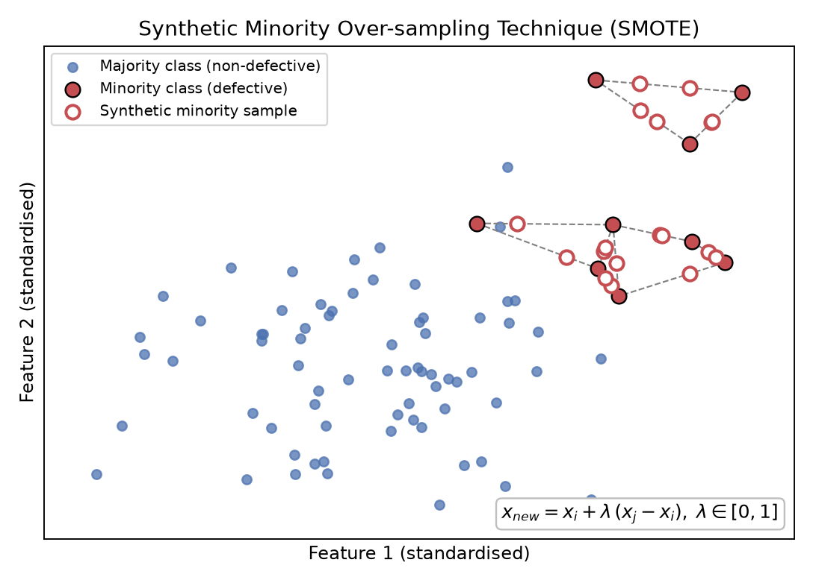

## 4.4 Classification Models

The eight classifiers in Table 4.3 span the principal model families used in the surveyed literature: linear, probabilistic, instance-based, kernel, single-tree, bagging [14], boosting [15] and neural. An optional randomised hyper-parameter search (15 iterations, F1 objective) is implemented but was not used for the main results, so that the comparison is not confounded by unequal tuning effort.

**Table 4.3 – Classifiers and principal hyper-parameters (scikit-learn defaults unless stated)**

| Model | Family | Key settings |
|---|---|---|
| Logistic Regression | Linear | L2 penalty, C = 1, maximum 2,000 iterations |
| Decision Tree | Single tree | Maximum depth 8, minimum 5 samples per leaf |
| Random Forest | Bagging ensemble | 300 trees, minimum 2 samples per leaf, √d features per split |
| Gradient Boosting | Boosting ensemble | 200 trees, learning rate 0.05, maximum depth 3 |
| SVM | Kernel [16] | RBF kernel, C = 1, γ = 'scale', Platt-scaled probabilities |
| k-Nearest Neighbours | Instance-based | k = 7, distance weighting |
| Gaussian Naive Bayes | Probabilistic | Default variance smoothing |
| MLP | Neural network | Hidden layers (64, 32), ReLU, Adam, α = 10⁻³, early stopping |

## 4.5 Validation Strategy

1. A **stratified hold-out split** (80 % training, 20 % test; random seed 42) is made once per dataset.
2. On the training portion, every model is evaluated with **stratified five-fold cross-validation** to estimate the mean and standard deviation of each metric.
3. Each model is then refitted on the entire training portion and scored once on the untouched test set. All headline numbers in Chapter 7 are hold-out results; cross-validation results are reported alongside them to indicate stability.

A single random seed controls the split, the folds, SMOTE and every stochastic learner, so that every number in this report is exactly reproducible.

## 4.6 Evaluation Metrics

The metrics are defined from the confusion matrix in Table 4.4, with the defective class as the positive class.

**Table 4.4 – Confusion matrix for the defect-prediction problem**

| | Predicted defective | Predicted non-defective |
|---|---|---|
| **Actually defective** | TP | FN |
| **Actually non-defective** | FP | TN |

* Accuracy = (TP + TN) / (TP + TN + FP + FN)
* Precision = TP / (TP + FP)
* Recall (probability of detection, PD) = TP / (TP + FN)
* F1-score = 2 · Precision · Recall / (Precision + Recall)
* Probability of false alarm, PF = FP / (FP + TN)
* Balanced accuracy = (Recall + (1 − PF)) / 2
* ROC-AUC = area under the curve of PD against PF over all classification thresholds
* MCC = (TP · TN − FP · FN) / √((TP + FP)(TP + FN)(TN + FP)(TN + FN))

F1-score is used as the primary ranking criterion because it balances the two costs that matter to practitioners — missed defects and wasted inspections — and ROC-AUC is used as the threshold-independent secondary criterion.

```{=openxml}
<w:p><w:r><w:br w:type="page"/></w:r></w:p>
```

# CHAPTER 5: SYSTEM DESIGN AND ARCHITECTURE

## 5.1 Architectural Overview

The system is organised as a layered Python application (Figure 5.1). A single YAML configuration file is the only place where experimental settings are defined; thin command-line scripts orchestrate the workflow; and all machine-learning logic resides in an importable package, `sdp`, with one module per responsibility.


## 5.2 Module Responsibilities

**Table 5.1 – Responsibilities of the `sdp` package modules**

| Module | Responsibility |
|---|---|
| `config.py` | Load and validate `config.yaml`; supply defaults |
| `utils.py` | Logging, seeding of all random-number generators, path resolution, JSON persistence |
| `data_loader.py` | Download datasets (GitHub mirror with OpenML fallback); ARFF parser; target normalisation |
| `preprocessing.py` | Cleaning, stratified split, preprocessing pipeline, SMOTE wrapping |
| `models.py` | Registry of classifiers and their hyper-parameter search spaces |
| `evaluate.py` | Metric computation, cross-validation, hold-out evaluation, result tables |
| `visualization.py` | All exploratory and evaluation figures |
| `eda.py` | Exploratory-analysis driver |

## 5.3 Data Flow

Figure 5.2 shows the level-1 data-flow diagram. The pipeline is strictly one-directional: raw data are never modified in place, and every artefact is written under `results/<DATASET>/`, so that runs with different settings can be kept side by side.

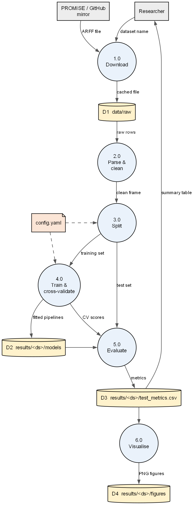

## 5.4 Use-Case View

Figure 5.3 presents the use-case view. A single actor — the researcher or developer — can download the datasets, explore them, train and compare the classifiers, score new modules with a trained model and run the automated tests. Training includes downloading, and prediction depends on a previously trained model.

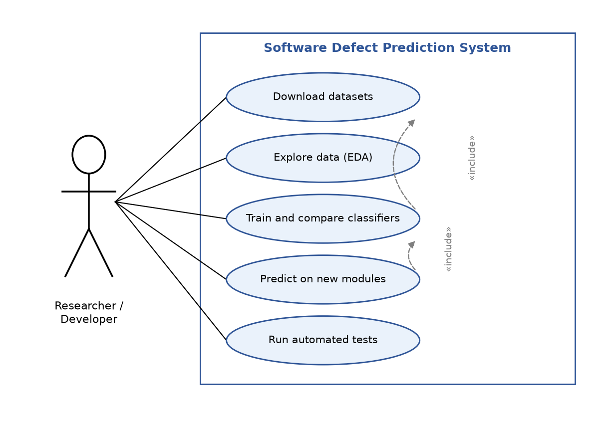

## 5.5 Design Decisions

* **Pipelines as the unit of modelling.** Every trained model is a single serialisable scikit-learn or imbalanced-learn `Pipeline` containing imputation, transformation, scaling, resampling and the estimator. This guarantees that identical preprocessing is applied at prediction time and removes any possibility of leakage.
* **Configuration over code.** Datasets, balancing strategy, cross-validation settings and the model list are changed in `config.yaml`, never in source code.
* **Registry pattern for models.** New classifiers are added by registering a factory function, leaving the training loop unchanged.
* **Headless plotting.** Figures are written to disk with a non-interactive backend so that the system runs on servers and in continuous-integration environments.

```{=openxml}
<w:p><w:r><w:br w:type="page"/></w:r></w:p>
```

# CHAPTER 6: IMPLEMENTATION

## 6.1 Environment

**Table 6.1 – Software tools and library versions**

| Component | Version | Purpose |
|---|---|---|
| Python | 3.13 (3.9 or later supported) | Programming language |
| NumPy / pandas | 2.2 / 2.2 | Numerical computing, data frames |
| SciPy | 1.18 | Statistical distributions for hyper-parameter search |
| scikit-learn | 1.9 | Classifiers, pipelines, metrics, cross-validation |
| imbalanced-learn | 0.14 | SMOTE and resampling-aware pipeline |
| matplotlib / seaborn | 3.11 / 0.13 | Figures |
| PyYAML | 6.0 | Configuration |
| joblib | 1.6 | Model persistence |
| pytest | 9.1 | Unit and smoke tests |
| Graphviz | 12.2 | Architecture diagrams |
| Operating system | Windows 11 | Development and testing platform (Linux and macOS supported) |

## 6.2 Directory Structure

```
software-defect-prediction/
├── config.yaml              # all experiment settings
├── requirements.txt         # dependencies
├── sdp/                     # package: config, utils, data_loader, preprocessing,
│                            #          models, evaluate, visualization, eda
├── scripts/                 # download_data.py, run_eda.py, run_pipeline.py,
│                            # predict.py, make_report_figures.py
├── tests/test_pipeline.py   # automated tests
├── data/raw/<variant>/      # downloaded .arff files
├── results/<DATASET>/       # eda/, figures/, models/, test_metrics.csv, run_summary.json
└── report/                  # this report, figures and references
```

## 6.3 Data Acquisition and Parsing

The function `download_dataset()` fetches `<NAME>.arff` from the GitHub mirror of the PROMISE repository and caches it locally; if the download fails it falls back to OpenML. A compact ARFF reader extracts attribute names from the `@attribute` declarations and parses the `@data` section with pandas, treating `?` as a missing value. The class attribute, named `Defective` in most files but `label` in JM1, is located by name and encoded as an integer column `defective`.

## 6.4 Preprocessing Pipeline

The pipeline is constructed as a flat sequence of named steps (Figure 6.1):

```python
steps = [("imputer", SimpleImputer(strategy="median")),
         ("log1p",   FunctionTransformer(np.log1p)),
         ("scaler",  StandardScaler())]
if balance == "smote":
    steps.append(("smote", SMOTE(random_state=seed)))
steps.append(("model", estimator))
pipeline = ImbPipeline(steps)
```

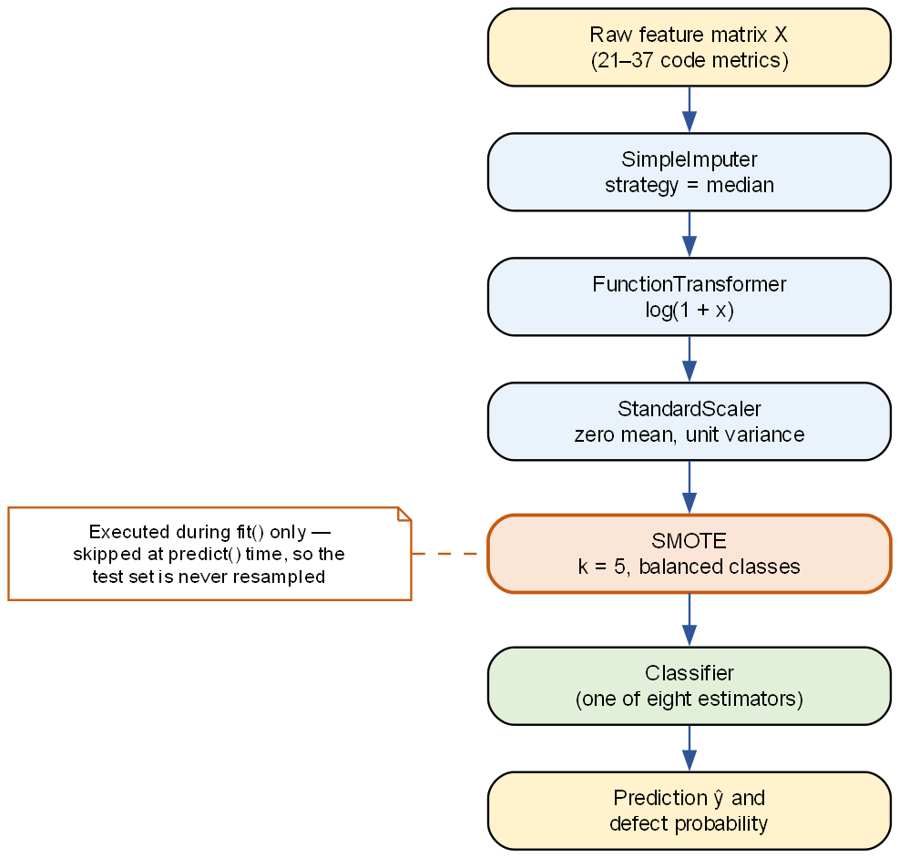

Because the imbalanced-learn pipeline executes the resampler only during `fit()` and skips it during `predict()`, the same object is used for cross-validation, final fitting and prediction on new data.

## 6.5 Training and Evaluation Loop

For each dataset, `run_pipeline.py` (i) loads and cleans the data; (ii) performs the stratified split; (iii) for each model, builds the pipeline, runs five-fold stratified cross-validation on the training set, optionally runs a randomised hyper-parameter search, fits on the full training set and evaluates on the test set; (iv) persists the fitted pipeline with joblib; and (v) writes `test_metrics.csv`, `test_metrics.json`, `run_summary.json` and the figures. When all datasets are processed together, the per-dataset tables are concatenated into `summary_all_datasets.csv` and cross-dataset heat maps are drawn. The console output for KC1 is reproduced below.

```
=== KC1: hold-out test results (sorted by F1) ===
| model                |   accuracy |   precision |   recall |     f1 |   roc_auc |    mcc |     pf |
|----------------------|------------|-------------|----------|--------|-----------|--------|--------|
| Gradient Boosting    |     0.7511 |      0.5085 |   0.5085 | 0.5085 |    0.7327 | 0.3418 | 0.1667 |
| k-Nearest Neighbours |     0.6996 |      0.4337 |   0.6102 | 0.5070 |    0.7287 | 0.3088 | 0.2701 |
| SVM (RBF)            |     0.6652 |      0.4040 |   0.6780 | 0.5063 |    0.7198 | 0.2981 | 0.3391 |
| Logistic Regression  |     0.6609 |      0.4000 |   0.6780 | 0.5031 |    0.7195 | 0.2927 | 0.3448 |
| Random Forest        |     0.7425 |      0.4918 |   0.5085 | 0.5000 |    0.7325 | 0.3267 | 0.1782 |
| MLP (Neural Network) |     0.6094 |      0.3667 |   0.7458 | 0.4916 |    0.7267 | 0.2688 | 0.4368 |
| Gaussian Naive Bayes |     0.6094 |      0.3571 |   0.6780 | 0.4678 |    0.7148 | 0.2299 | 0.4138 |
| Decision Tree        |     0.6867 |      0.3971 |   0.4576 | 0.4252 |    0.6537 | 0.2123 | 0.2356 |
Best model: Gradient Boosting  (F1=0.5085, ROC-AUC=0.7327)
```

## 6.6 Prediction Interface

The script `predict.py` loads a saved pipeline, verifies that the input CSV contains the expected metric columns, and appends `defect_probability` and `predicted_defective` columns. A threshold argument allows the operating point to be adjusted — for example, lowered to 0.3 when recall is more important than precision. Scoring two sample modules with the KC1 Gradient Boosting model gives:

```
   defect_probability  predicted_defective
0              0.0564                    0      (5 LOC, cyclomatic complexity 1)
1              0.6986                    1      (160 LOC, cyclomatic complexity 13)
```

## 6.7 Testing

Nine pytest cases cover ARFF parsing, target encoding, duplicate and constant-feature removal, stratification, metric correctness on a perfect prediction, an end-to-end fit-and-predict test of every registered model under all three balancing modes, and determinism of repeated runs. All tests pass:

```
$ python -m pytest -q
.........                                                    [100%]
9 passed in 3.89s
```

```{=openxml}
<w:p><w:r><w:br w:type="page"/></w:r></w:p>
```

# CHAPTER 7: RESULTS AND ANALYSIS

All results in this chapter were generated with random seed 42, SMOTE balancing and five-fold cross-validation. Complete tables for JM1, PC1 and CM1 are given in Appendix B.

## 7.1 Exploratory Data Analysis (RQ1)

Figure 7.1 shows the class distribution of KC1: 868 non-defective modules versus 294 defective modules (25.3 %). Table 7.1 lists the ten metrics most correlated with the defect label.

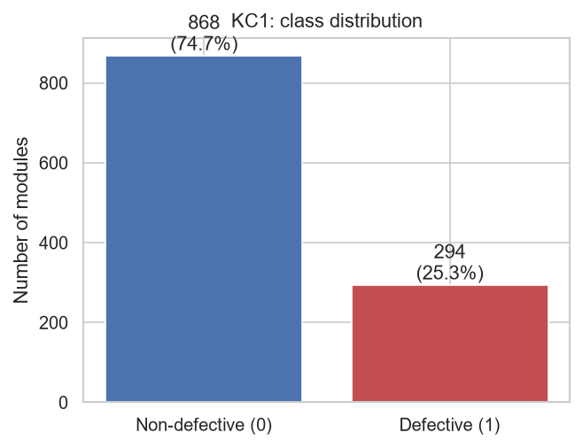

**Table 7.1 – Descriptive statistics of the most informative KC1 metrics (ranked by correlation with the defect label)**

| Metric | Mean | Median | Maximum | Skewness | Correlation with target |
|---|---|---|---|---|---|
| HALSTEAD_DIFFICULTY | 10.37 | 7.78 | 53.75 | 1.61 | 0.303 |
| NUM_UNIQUE_OPERATORS | 10.59 | 10.00 | 37.00 | 0.77 | 0.301 |
| NUM_UNIQUE_OPERANDS | 15.08 | 11.00 | 120.00 | 1.88 | 0.300 |
| NUM_OPERANDS | 31.19 | 17.00 | 428.00 | 2.94 | 0.285 |
| HALSTEAD_LENGTH | 82.07 | 45.00 | 1,106.00 | 2.93 | 0.275 |
| NUM_OPERATORS | 50.89 | 28.00 | 678.00 | 2.92 | 0.268 |
| HALSTEAD_ERROR_EST | 0.15 | 0.07 | 2.64 | 3.61 | 0.267 |
| HALSTEAD_VOLUME | 438.49 | 197.29 | 7,918.82 | 3.62 | 0.267 |
| LOC_TOTAL | 32.31 | 20.00 | 288.00 | 2.69 | 0.264 |
| LOC_EXECUTABLE | 24.19 | 14.00 | 262.00 | 2.73 | 0.254 |

Three observations follow. First, every metric is strongly right-skewed (the median lies far below the mean; skewness 0.8–3.7), which justifies the logarithmic transformation. Second, all correlations with the label are positive but modest (at most 0.30): larger and more complex modules are more likely to be defective, but no single metric is decisive. Third, the correlation heat map in Figure 7.2 shows that the Halstead and size metrics are very highly inter-correlated (Spearman ρ > 0.9 for many pairs) because they are all functions of the same operator and operand counts — an important caveat when interpreting feature importance. Figure 7.3 confirms that the defective class has a visibly higher median for every top metric, and Figure 7.4 ranks all 21 metrics by their correlation with the label.

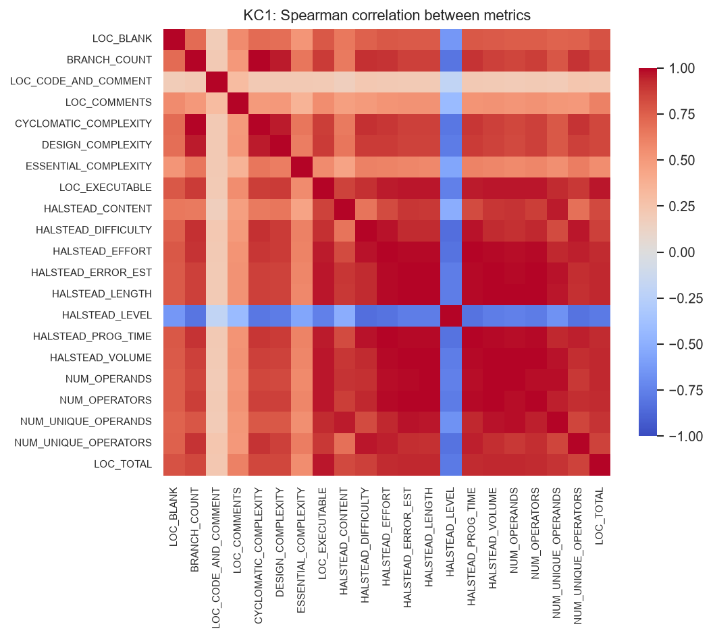

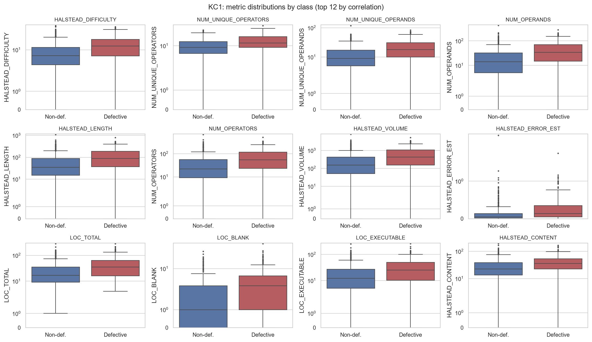

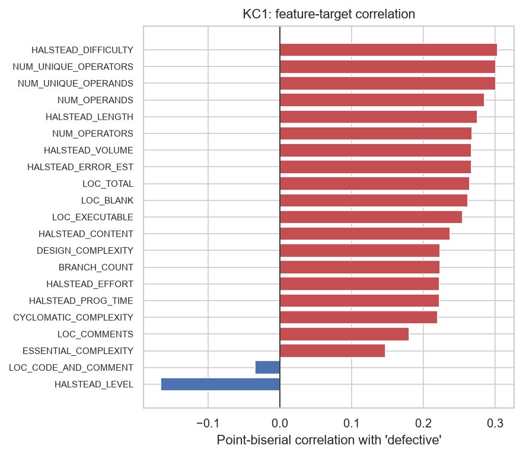

## 7.2 Classifier Comparison on KC1 (RQ2)

Table 7.2 gives the hold-out results on KC1 and Table 7.3 the corresponding cross-validation estimates.

**Table 7.2 – Hold-out test performance on KC1 (233 modules, 59 defective), sorted by F1-score; best value per column in bold**

| Model | Accuracy | Precision | Recall | F1 | ROC-AUC | MCC | PF |
|---|---|---|---|---|---|---|---|
| Gradient Boosting | **0.751** | **0.509** | 0.509 | **0.509** | **0.733** | **0.342** | **0.167** |
| k-Nearest Neighbours | 0.700 | 0.434 | 0.610 | 0.507 | 0.729 | 0.309 | 0.270 |
| SVM (RBF) | 0.665 | 0.404 | 0.678 | 0.506 | 0.720 | 0.298 | 0.339 |
| Logistic Regression | 0.661 | 0.400 | 0.678 | 0.503 | 0.720 | 0.293 | 0.345 |
| Random Forest | 0.743 | 0.492 | 0.509 | 0.500 | **0.733** | 0.327 | 0.178 |
| MLP | 0.609 | 0.367 | **0.746** | 0.492 | 0.727 | 0.269 | 0.437 |
| Gaussian Naive Bayes | 0.609 | 0.357 | 0.678 | 0.468 | 0.715 | 0.230 | 0.414 |
| Decision Tree | 0.687 | 0.397 | 0.458 | 0.425 | 0.654 | 0.212 | 0.236 |

**Table 7.3 – Five-fold cross-validation results on the KC1 training set (mean ± standard deviation)**

| Model | Accuracy | Precision | Recall | F1 | ROC-AUC |
|---|---|---|---|---|---|
| Gradient Boosting | 0.723 ± 0.011 | 0.456 ± 0.021 | 0.485 ± 0.045 | 0.469 ± 0.031 | 0.700 ± 0.029 |
| k-Nearest Neighbours | 0.666 ± 0.028 | 0.389 ± 0.035 | 0.545 ± 0.022 | 0.453 ± 0.030 | 0.678 ± 0.019 |
| SVM (RBF) | 0.687 ± 0.029 | 0.422 ± 0.034 | 0.613 ± 0.025 | **0.498 ± 0.021** | 0.685 ± 0.033 |
| Logistic Regression | 0.649 ± 0.036 | 0.389 ± 0.034 | **0.664 ± 0.043** | 0.490 ± 0.035 | 0.696 ± 0.037 |
| Random Forest | **0.729 ± 0.013** | **0.466 ± 0.025** | 0.481 ± 0.037 | 0.472 ± 0.022 | **0.712 ± 0.022** |
| MLP | 0.643 ± 0.043 | 0.378 ± 0.040 | 0.617 ± 0.047 | 0.468 ± 0.039 | 0.686 ± 0.031 |
| Gaussian Naive Bayes | 0.625 ± 0.027 | 0.367 ± 0.020 | 0.651 ± 0.029 | 0.468 ± 0.016 | 0.692 ± 0.034 |
| Decision Tree | 0.651 ± 0.017 | 0.360 ± 0.023 | 0.489 ± 0.047 | 0.415 ± 0.031 | 0.627 ± 0.039 |

**Analysis.** Seven of the eight models are tightly clustered (hold-out F1 0.47–0.51, ROC-AUC 0.72–0.73); only the single Decision Tree is clearly inferior, confirming the observation of Lessmann et al. [4] that most reasonable learners are hard to separate on these data. Within the cluster, two operating profiles are evident in Figure 7.5:

* **Conservative models** — Gradient Boosting and Random Forest — achieve the highest accuracy, precision and MCC with a low false-alarm rate (PF ≈ 0.17), but detect only about half of the defective modules.
* **Sensitive models** — MLP, SVM, Logistic Regression and Naive Bayes — detect 68–75 % of defects but raise false alarms on 34–44 % of clean modules.

The ROC curves in Figure 7.6 overlap almost completely, and the precision–recall curves in Figure 7.7 show that no model exceeds about 0.5 precision at 0.5 recall. Cross-validation standard deviations (Table 7.3, Figure 7.9) are 0.02–0.04, so differences of a few hundredths in F1 are not statistically meaningful; the rank of Gradient Boosting as "best" on KC1 should be read as "among the best". The confusion matrices in Figure 7.8 make the trade-off tangible: Gradient Boosting yields 30 true positives, 29 false positives and 29 false negatives, whereas the MLP yields 44 true positives, 76 false positives and 15 false negatives.

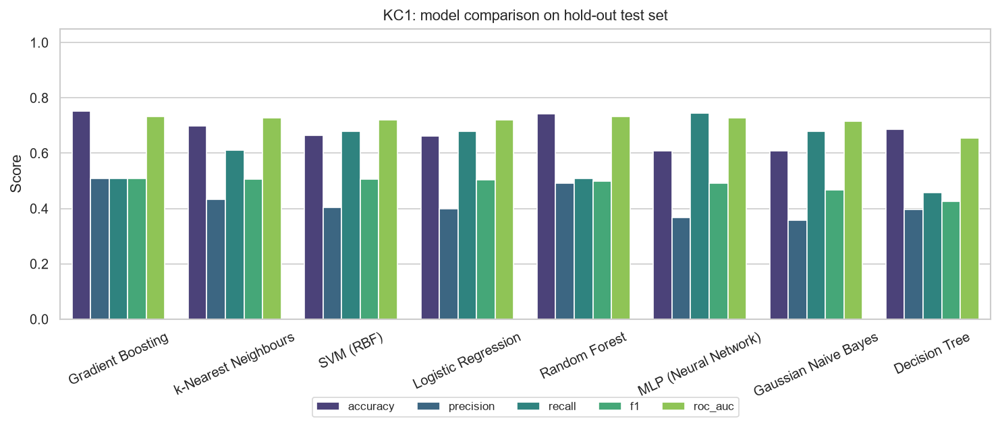


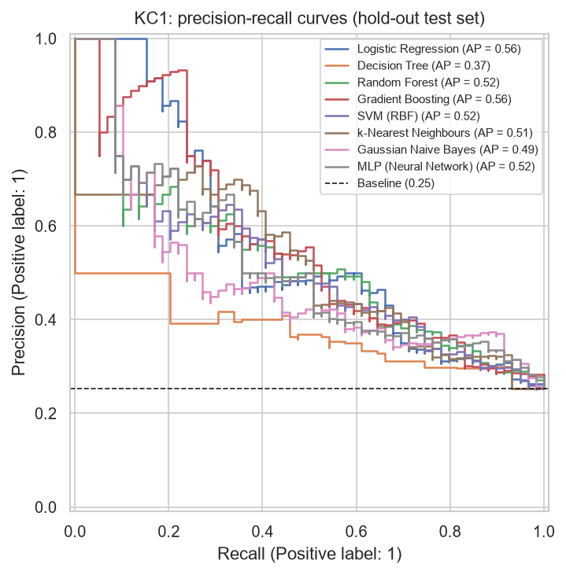

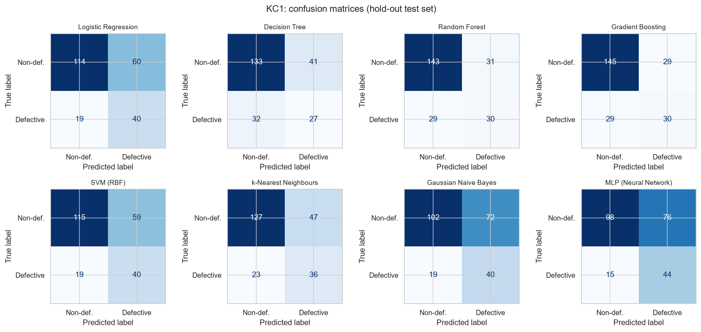

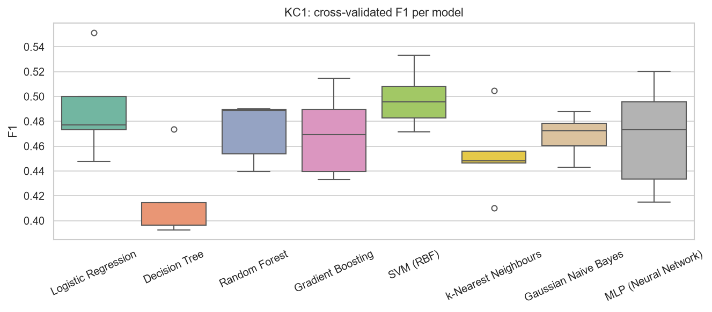

**Feature importance.** Figure 7.10 shows the Random Forest impurity-based importances. Halstead difficulty, unique operand and operator counts and executable lines of code dominate, in agreement with the correlation analysis of Section 7.1. Because of the strong collinearity among the Halstead measures, importance is shared among near-duplicate metrics and should not be over-interpreted.

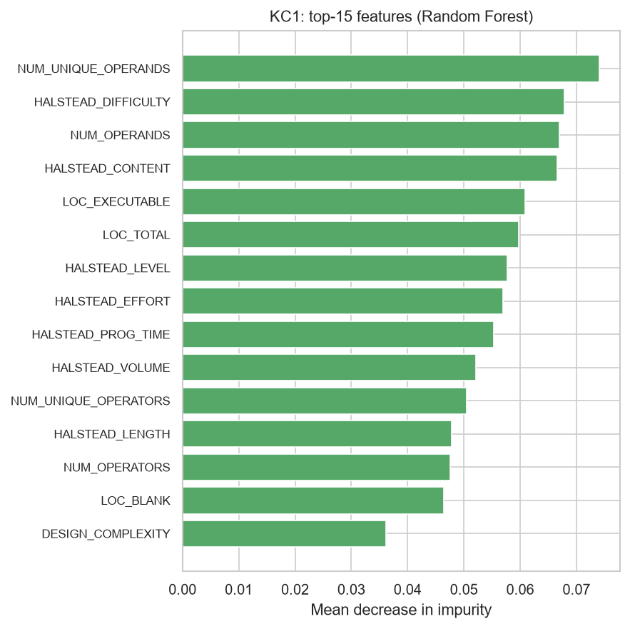

## 7.3 Results Across All Datasets (RQ2)

Table 7.4 and Figures 7.11 and 7.12 summarise the hold-out F1-score and ROC-AUC of every model on every dataset; Table 7.5 gives the mean rank.

**Table 7.4 – F1-score / ROC-AUC on the hold-out set of every dataset (best value per column in bold)**

| Model | KC1 | JM1 | PC1 | CM1 |
|---|---|---|---|---|
| Gradient Boosting | **0.509** / **0.733** | 0.410 / 0.709 | **0.333** / **0.858** | **0.400** / **0.795** |
| k-Nearest Neighbours | 0.507 / 0.729 | 0.419 / 0.664 | 0.273 / 0.688 | 0.359 / 0.793 |
| SVM (RBF) | 0.506 / 0.720 | 0.430 / 0.688 | 0.222 / 0.817 | 0.381 / 0.711 |
| Logistic Regression | 0.503 / 0.720 | 0.446 / 0.714 | 0.250 / 0.801 | 0.357 / 0.739 |
| Random Forest | 0.500 / **0.733** | **0.461** / **0.717** | 0.273 / 0.779 | 0.143 / 0.778 |
| MLP | 0.492 / 0.727 | 0.427 / 0.681 | 0.278 / 0.855 | 0.258 / 0.705 |
| Gaussian Naive Bayes | 0.468 / 0.715 | 0.416 / 0.679 | 0.327 / 0.793 | 0.323 / 0.752 |
| Decision Tree | 0.425 / 0.654 | 0.429 / 0.681 | 0.267 / 0.643 | 0.261 / 0.676 |

**Table 7.5 – Mean rank of each classifier by F1-score across the four datasets (1 = best)**

| Rank | Model | Mean rank |
|---|---|---|
| 1 | Gradient Boosting | 2.75 |
| 2 | k-Nearest Neighbours | 3.88 |
| 3 | SVM (RBF) | 4.00 |
| 4 | Logistic Regression | 4.25 |
| 5 | Random Forest | 4.62 |
| 6 | Gaussian Naive Bayes | 5.25 |
| 6 | MLP | 5.25 |
| 8 | Decision Tree | 6.00 |


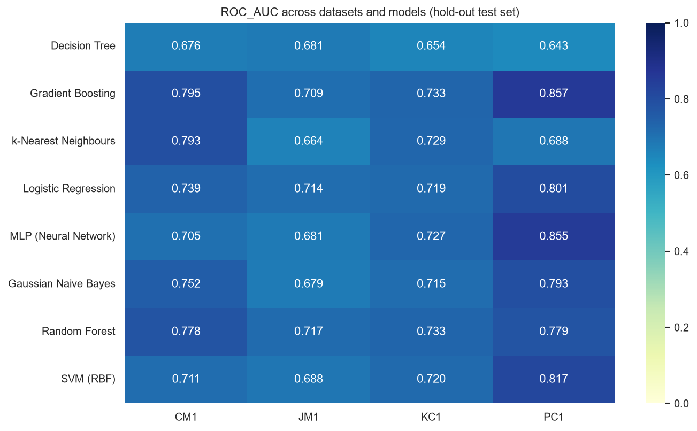

**Analysis.** Gradient Boosting is the most consistent performer, ranking first on three datasets and achieving the best mean rank. Random Forest is best on the largest dataset (JM1, 7,720 modules), where its variance-reduction advantage has enough data to work with, but performs poorly on the smallest (CM1, 327 modules, 42 defective), with F1 = 0.14. With only eight positive examples in the CM1 test set, a single misclassification changes recall by 12.5 percentage points, so the CM1 results carry very high variance.

F1-score falls sharply as the defect ratio decreases (KC1 25 % → PC1 8 %): on PC1 the best F1 is 0.33 even though ROC-AUC is the highest of all datasets (0.86). This illustrates that ROC-AUC, which is insensitive to class prevalence, can appear optimistic when positives are rare, whereas F1 and precision reflect the practical difficulty of finding a handful of defective modules among many clean ones. The Decision Tree is last or near-last on every dataset, reflecting its high variance without ensembling.

## 7.4 Effect of Class Balancing (RQ3)

Table 7.6 compares each model on the KC1 hold-out set with and without SMOTE; all other settings are identical.

**Table 7.6 – Effect of SMOTE on the KC1 hold-out set (values shown as no balancing → SMOTE)**

| Model | Precision | Recall | F1 | Accuracy | PF |
|---|---|---|---|---|---|
| Logistic Regression | 1.000 → 0.400 | 0.153 → 0.678 | 0.265 → 0.503 | 0.785 → 0.661 | 0.000 → 0.345 |
| SVM (RBF) | 1.000 → 0.404 | 0.153 → 0.678 | 0.265 → 0.506 | 0.785 → 0.665 | 0.000 → 0.339 |
| MLP | 0.727 → 0.367 | 0.136 → 0.746 | 0.229 → 0.492 | 0.768 → 0.609 | 0.017 → 0.437 |
| Gradient Boosting | 0.778 → 0.509 | 0.237 → 0.509 | 0.364 → 0.509 | 0.790 → 0.751 | 0.023 → 0.167 |
| Random Forest | 0.615 → 0.492 | 0.271 → 0.509 | 0.377 → 0.500 | 0.773 → 0.743 | 0.058 → 0.178 |
| k-Nearest Neighbours | 0.647 → 0.434 | 0.373 → 0.610 | 0.473 → 0.507 | 0.790 → 0.700 | 0.069 → 0.270 |
| Decision Tree | 0.583 → 0.397 | 0.356 → 0.458 | 0.442 → 0.425 | 0.773 → 0.687 | 0.086 → 0.236 |
| Gaussian Naive Bayes | 0.376 → 0.357 | 0.695 → 0.678 | 0.488 → 0.468 | 0.631 → 0.609 | 0.391 → 0.414 |

**Analysis.** Without balancing, the margin- and gradient-based models are almost useless as detectors: Logistic Regression and SVM flag only 9 of the 59 defective modules (recall 0.15), achieving perfect precision and a deceptively high accuracy of 78.5 % — barely above the 74.7 % of a constant "non-defective" predictor. SMOTE raises their recall more than four-fold (0.15 → 0.68) and nearly doubles their F1-score (0.26 → 0.50), at the cost of about 12 percentage points of accuracy and a false-alarm rate of about 0.34. The ensembles gain less in absolute terms but still improve F1 by 0.12–0.15. Naive Bayes is essentially unaffected because its class priors already give it high recall, consistent with the findings of Menzies et al. [3]. These results reproduce the conclusions of Tantithamthavorn et al. [9]: rebalancing benefits recall-oriented defect prediction and should be the default for most classifiers, while accuracy should not be used as the primary metric.

## 7.5 Comparison with Published Results

Table 7.7 places the results in the context of the literature. Exact numerical comparison is limited because earlier studies used the raw data, different splits and, in some cases, different metric definitions.

**Table 7.7 – Comparison with previously published results on the NASA data**

| Study | Data version | Reported finding | This project (hold-out) |
|---|---|---|---|
| Menzies et al. [3], Naive Bayes with log transform | Raw MDP | Mean PD ≈ 0.71, PF ≈ 0.25 over eight datasets | NB: PD 0.68, PF 0.41 (KC1); PD 0.73, PF 0.24 (PC1) |
| Lessmann et al. [4] | Raw MDP | RF among the top classifiers; most classifiers statistically similar on AUC | RF and GB tied at AUC 0.733 on KC1; seven of eight models within 0.02 AUC |
| Ghotra et al. [7] | Cleaned D″ | Ensembles in the top statistical group; AUC mostly 0.70–0.80 on NASA sets | GB: AUC 0.71–0.86 across the four datasets |
| Shepperd et al. [6] | Raw versus cleaned | Results differ materially between raw and cleaned versions | Raw KC1 after duplicate removal: AUC 0.62–0.67; cleaned D″: AUC 0.65–0.73 |

The values obtained here are consistent with published figures on the cleaned data and with the qualitative findings of the earlier studies on raw data. Results reported on raw data are inflated by duplicate records, so direct numerical comparison with the older studies must be made with caution.

## 7.6 Threats to Validity

* **Construct validity.** Static metrics are a proxy for defect-proneness, and "defective" means that at least one defect was *recorded*, which depends on the reporting practice of each project.
* **Internal validity.** Default hyper-parameters were used for all models; tuning could change the ranking. A single random seed was used; repeated cross-validation with several seeds, which the configuration supports, would tighten the confidence intervals.
* **External validity.** The NASA systems are C and C++ flight and ground software from the 1990s and 2000s; the findings may not transfer to modern web, mobile or open-source projects.
* **Conclusion validity.** The smaller datasets (CM1 and PC1) yield test sets with only 8–11 positive examples, so their results are indicative rather than definitive.

```{=openxml}
<w:p><w:r><w:br w:type="page"/></w:r></w:p>
```

# CHAPTER 8: CONCLUSION AND FUTURE SCOPE

## 8.1 Conclusion

This project set out to survey the software-defect-prediction literature and to reproduce, in a methodologically sound manner, the standard classifier-comparison study on the NASA MDP datasets. A complete, configurable and tested Python system was built that downloads the cleaned datasets, performs exploratory analysis, applies a leakage-free preprocessing pipeline with SMOTE, trains and cross-validates eight classifiers, and reports seven complementary metrics with publication-quality figures.

The principal findings are as follows.

1. **Metrics (RQ1).** Halstead difficulty, distinct operator and operand counts and executable lines of code are the metrics most associated with defects, but the correlations are modest (at most 0.30) and the metric families are highly collinear.
2. **Classifiers (RQ2).** Gradient Boosting was the most consistent classifier, with the best F1-score on KC1, PC1 and CM1 and a mean rank of 2.75; Random Forest was best on the largest dataset, JM1. Most classifiers, however, lie within cross-validation noise of one another, while a single Decision Tree is reliably the weakest. Predictive performance is bounded (ROC-AUC 0.71–0.86; F1 0.33–0.51), reflecting the limited information contained in static metrics alone.
3. **Class balancing (RQ3).** SMOTE is essential for recall-oriented prediction: it raised the recall of Logistic Regression and SVM on KC1 from 0.15 to 0.68 and nearly doubled their F1-score, while accuracy, shown to be a misleading metric in this setting, decreased.

The results reproduce the qualitative conclusions of Menzies et al. [3], Lessmann et al. [4], Ghotra et al. [7] and Tantithamthavorn et al. [9], thereby satisfying the Minor Project course outcomes of identifying a research problem through a literature survey and analysing and reproducing an existing solution.

## 8.2 Future Scope

* **Statistical rigour.** Repeated cross-validation over multiple seeds with Scott–Knott ESD or Nemenyi post-hoc tests to establish statistically significant performance groups.
* **Hyper-parameter optimisation.** Bayesian or randomised search for every model, already scaffolded in the code base, to check whether the ranking changes.
* **Threshold and cost-sensitive tuning.** Choosing the operating threshold to minimise an explicit cost function that weighs a missed defect against an unnecessary inspection.
* **Feature engineering and selection.** Removing collinear Halstead variants, adding ratio features such as comments per line of code, and applying information-gain or wrapper-based selection.
* **Richer data.** Process metrics (code churn, number of developers, ownership) from version-control history, which the literature shows to be more predictive than static metrics, and modern datasets such as the PROMISE Jureczko/Apache collection.
* **Cross-project prediction.** Transfer learning to predict defects in a project with no labelled history.
* **Explainability.** Shapley-value explanations of individual predictions for developers.
* **Deployment.** Packaging the predictor as a continuous-integration step or IDE plug-in that ranks changed files for review on every commit.

```{=openxml}
<w:p><w:r><w:br w:type="page"/></w:r></w:p>
```

# REFERENCES

[1] T. J. McCabe, "A complexity measure," *IEEE Transactions on Software Engineering*, vol. SE-2, no. 4, pp. 308–320, 1976.

[2] M. H. Halstead, *Elements of Software Science*. New York, NY, USA: Elsevier North-Holland, 1977.

[3] T. Menzies, J. Greenwald, and A. Frank, "Data mining static code attributes to learn defect predictors," *IEEE Transactions on Software Engineering*, vol. 33, no. 1, pp. 2–13, 2007.

[4] S. Lessmann, B. Baesens, C. Mues, and S. Pietsch, "Benchmarking classification models for software defect prediction: A proposed framework and novel findings," *IEEE Transactions on Software Engineering*, vol. 34, no. 4, pp. 485–496, 2008.

[5] T. Hall, S. Beecham, D. Bowes, D. Gray, and S. Counsell, "A systematic literature review on fault prediction performance in software engineering," *IEEE Transactions on Software Engineering*, vol. 38, no. 6, pp. 1276–1304, 2012.

[6] M. Shepperd, Q. Song, Z. Sun, and C. Mair, "Data quality: Some comments on the NASA software defect datasets," *IEEE Transactions on Software Engineering*, vol. 39, no. 9, pp. 1208–1215, 2013.

[7] B. Ghotra, S. McIntosh, and A. E. Hassan, "Revisiting the impact of classification techniques on the performance of defect prediction models," in *Proceedings of the 37th IEEE/ACM International Conference on Software Engineering (ICSE)*, Florence, Italy, 2015, pp. 789–800.

[8] N. V. Chawla, K. W. Bowyer, L. O. Hall, and W. P. Kegelmeyer, "SMOTE: Synthetic minority over-sampling technique," *Journal of Artificial Intelligence Research*, vol. 16, pp. 321–357, 2002.

[9] C. Tantithamthavorn, A. E. Hassan, and K. Matsumoto, "The impact of class rebalancing techniques on the performance and interpretation of defect prediction models," *IEEE Transactions on Software Engineering*, vol. 46, no. 11, pp. 1200–1219, 2020.

[10] D. Chicco and G. Jurman, "The advantages of the Matthews correlation coefficient (MCC) over F1 score and accuracy in binary classification evaluation," *BMC Genomics*, vol. 21, no. 6, 2020.

[11] R. Malhotra, "A systematic review of machine learning techniques for software fault prediction," *Applied Soft Computing*, vol. 27, pp. 504–518, 2015.

[12] R. S. Wahono, "A systematic literature review of software defect prediction: Research trends, datasets, methods and frameworks," *Journal of Software Engineering*, vol. 1, no. 1, pp. 1–16, 2015.

[13] Z. Li, X.-Y. Jing, and X. Zhu, "Progress on approaches to software defect prediction," *IET Software*, vol. 12, no. 3, pp. 161–175, 2018.

[14] L. Breiman, "Random forests," *Machine Learning*, vol. 45, no. 1, pp. 5–32, 2001.

[15] J. H. Friedman, "Greedy function approximation: A gradient boosting machine," *The Annals of Statistics*, vol. 29, no. 5, pp. 1189–1232, 2001.

[16] C. Cortes and V. Vapnik, "Support-vector networks," *Machine Learning*, vol. 20, no. 3, pp. 273–297, 1995.

[17] J. Sayyad Shirabad and T. Menzies, "The PROMISE repository of software engineering databases," School of Information Technology and Engineering, University of Ottawa, Canada, 2005. [Online]. Available: http://promise.site.uottawa.ca/SERepository

[18] "NASADefectDataset: Original and cleaned NASA MDP software defect datasets," GitHub repository. [Online]. Available: https://github.com/klainfo/NASADefectDataset (accessed 26 Sep. 2026).

[19] F. Pedregosa *et al.*, "Scikit-learn: Machine learning in Python," *Journal of Machine Learning Research*, vol. 12, pp. 2825–2830, 2011.

[20] G. Lemaître, F. Nogueira, and C. K. Aridas, "Imbalanced-learn: A Python toolbox to tackle the curse of imbalanced datasets in machine learning," *Journal of Machine Learning Research*, vol. 18, no. 17, pp. 1–5, 2017.

[21] B. W. Boehm, *Software Engineering Economics*. Englewood Cliffs, NJ, USA: Prentice-Hall, 1981.

[22] B. W. Boehm and V. R. Basili, "Software defect reduction top 10 list," *IEEE Computer*, vol. 34, no. 1, pp. 135–137, 2001.

```{=openxml}
<w:p><w:r><w:br w:type="page"/></w:r></w:p>
```

# APPENDIX A: SOURCE CODE ORGANISATION

The complete source code is submitted with this report. Table A.1 lists the principal files.

**Table A.1 – Source files and their purpose**

| File | Purpose | Lines |
|---|---|---|
| `config.yaml` | Experiment configuration | 71 |
| `sdp/config.py` | Configuration loading and validation | 47 |
| `sdp/utils.py` | Logging, seeding, paths, JSON persistence | 72 |
| `sdp/data_loader.py` | Download, ARFF parsing, target encoding | 153 |
| `sdp/preprocessing.py` | Cleaning, split, pipeline, SMOTE | 116 |
| `sdp/models.py` | Model registry and search spaces | 107 |
| `sdp/evaluate.py` | Metrics, cross-validation, hold-out evaluation | 114 |
| `sdp/visualization.py` | Figures | 193 |
| `sdp/eda.py` | Exploratory-analysis driver | 65 |
| `scripts/download_data.py` | Dataset download | 33 |
| `scripts/run_eda.py` | EDA entry point | 37 |
| `scripts/run_pipeline.py` | Training and evaluation entry point | 188 |
| `scripts/predict.py` | Prediction interface | 59 |
| `tests/test_pipeline.py` | Automated test suite | 119 |

# APPENDIX B: COMPLETE RESULT TABLES

**Table B.1 – Hold-out test performance on JM1 (1,544 modules, 322 defective)**

| Model | Accuracy | Precision | Recall | F1 | ROC-AUC | MCC | PF |
|---|---|---|---|---|---|---|---|
| Random Forest | 0.799 | 0.522 | 0.413 | 0.461 | 0.717 | 0.343 | 0.100 |
| Logistic Regression | 0.674 | 0.345 | 0.630 | 0.446 | 0.714 | 0.264 | 0.315 |
| SVM (RBF) | 0.661 | 0.331 | 0.615 | 0.430 | 0.688 | 0.240 | 0.327 |
| Decision Tree | 0.704 | 0.359 | 0.534 | 0.430 | 0.681 | 0.249 | 0.251 |
| MLP | 0.686 | 0.345 | 0.562 | 0.427 | 0.681 | 0.241 | 0.282 |
| k-Nearest Neighbours | 0.648 | 0.320 | 0.609 | 0.419 | 0.664 | 0.222 | 0.341 |
| Gaussian Naive Bayes | 0.688 | 0.341 | 0.534 | 0.417 | 0.679 | 0.227 | 0.272 |
| Gradient Boosting | 0.756 | 0.413 | 0.407 | 0.410 | 0.709 | 0.256 | 0.152 |

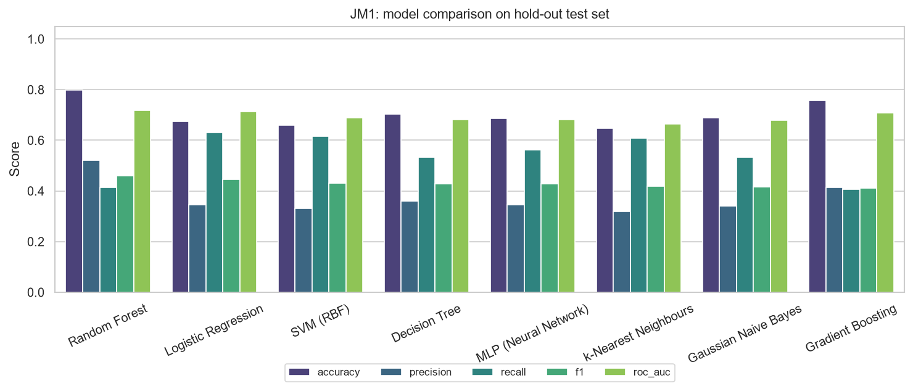

**Table B.2 – Hold-out test performance on PC1 (136 modules, 11 defective)**

| Model | Accuracy | Precision | Recall | F1 | ROC-AUC | MCC | PF |
|---|---|---|---|---|---|---|---|
| Gradient Boosting | 0.882 | 0.308 | 0.364 | 0.333 | 0.858 | 0.270 | 0.072 |
| Gaussian Naive Bayes | 0.757 | 0.211 | 0.727 | 0.327 | 0.794 | 0.296 | 0.240 |
| MLP | 0.809 | 0.200 | 0.455 | 0.278 | 0.855 | 0.207 | 0.160 |
| Random Forest | 0.882 | 0.273 | 0.273 | 0.273 | 0.779 | 0.209 | 0.064 |
| k-Nearest Neighbours | 0.765 | 0.182 | 0.545 | 0.273 | 0.688 | 0.210 | 0.216 |
| Decision Tree | 0.838 | 0.211 | 0.364 | 0.267 | 0.643 | 0.192 | 0.120 |
| Logistic Regression | 0.779 | 0.172 | 0.455 | 0.250 | 0.802 | 0.175 | 0.192 |
| SVM (RBF) | 0.846 | 0.188 | 0.273 | 0.222 | 0.817 | 0.143 | 0.104 |

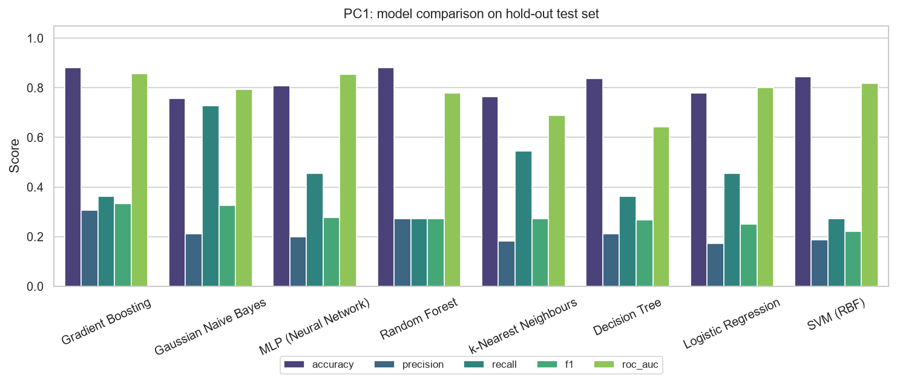

**Table B.3 – Hold-out test performance on CM1 (66 modules, 8 defective)**

| Model | Accuracy | Precision | Recall | F1 | ROC-AUC | MCC | PF |
|---|---|---|---|---|---|---|---|
| Gradient Boosting | 0.864 | 0.429 | 0.375 | 0.400 | 0.795 | 0.324 | 0.069 |
| SVM (RBF) | 0.803 | 0.308 | 0.500 | 0.381 | 0.711 | 0.283 | 0.155 |
| k-Nearest Neighbours | 0.621 | 0.226 | 0.875 | 0.359 | 0.793 | 0.302 | 0.414 |
| Logistic Regression | 0.727 | 0.250 | 0.625 | 0.357 | 0.739 | 0.260 | 0.259 |
| Gaussian Naive Bayes | 0.682 | 0.217 | 0.625 | 0.323 | 0.752 | 0.216 | 0.310 |
| Decision Tree | 0.742 | 0.200 | 0.375 | 0.261 | 0.676 | 0.131 | 0.207 |
| MLP | 0.652 | 0.174 | 0.500 | 0.258 | 0.705 | 0.118 | 0.328 |
| Random Forest | 0.818 | 0.167 | 0.125 | 0.143 | 0.778 | 0.044 | 0.086 |

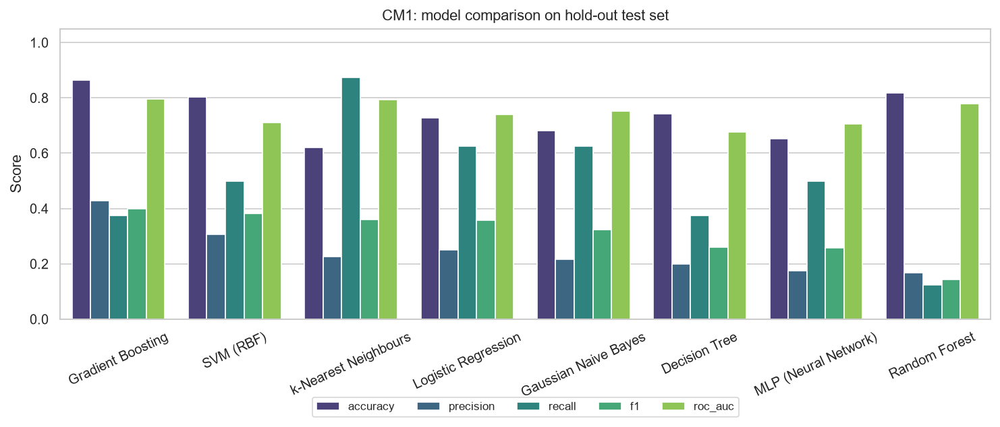

# APPENDIX C: EXECUTION INSTRUCTIONS

The following commands, executed from the project root with Python 3.9 or later, reproduce every result in this report.

```
pip install -r requirements.txt
python scripts/download_data.py                              # fetch KC1, JM1, PC1, CM1
python scripts/run_eda.py --all                              # EDA figures and statistics
python scripts/run_pipeline.py --all                         # train, cross-validate, evaluate
python scripts/run_pipeline.py --dataset KC1 --balance none  # ablation study (Table 7.6)
python -m pytest -q                                          # automated tests
```

Outputs are written to `results/<DATASET>/` and `results/summary_all_datasets.csv`.
